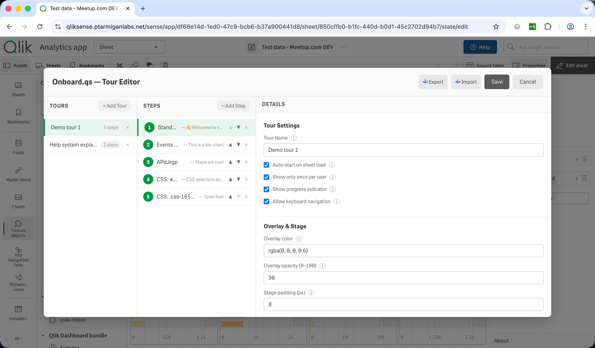
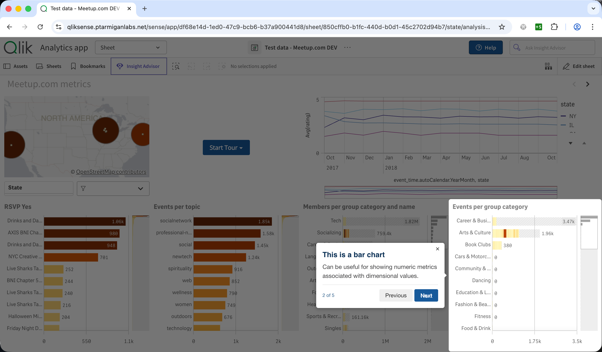
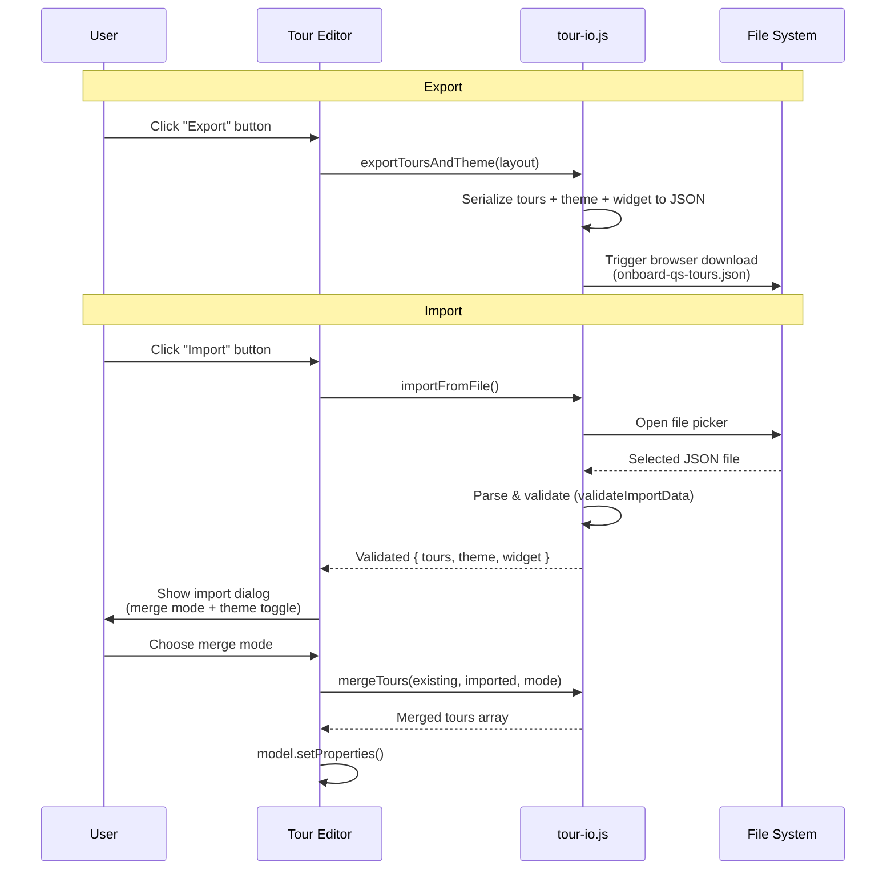

# Onboard.qs

Interactive onboarding tours for Qlik Sense apps — no coding required.  
Works with both **Qlik Sense Cloud** and **Qlik Sense Enterprise on Windows** (client-managed).

Drop this extension onto any Qlik Sense sheet to create guided, step-by-step walkthroughs that highlight objects, explain visualisations, and help new users find their way around your apps.

<p align="center">
  
</p>

---

## Features

- **Visual tour builder** — full-screen modal editor with three-panel layout (tours / steps / details). No need to leave the Sense app to configure tours.
- **Multiple tours per sheet** — define intro tours, advanced walkthroughs, or feature announcements, each with independent settings.
- **Sheet object targeting** — select any object on the current sheet from a dropdown. The extension resolves the correct DOM element at runtime.
- **Custom CSS selector targeting** — target any DOM element (toolbar buttons, header items, other extensions) with a raw CSS selector.
- **Markdown descriptions** — step descriptions support Markdown: **bold**, _italic_, [links](url), , lists, blockquotes, inline code, and more.
- **Auto-start with show-once** — tours can launch automatically when the sheet loads and remember whether the user has already seen them.
- **Theme presets & color pickers** — choose from four built-in presets (Default, The Lean Green Machine, Corporate Blue, Corporate Gold) or override every color individually. Font sizes, border radii, font weight, and font family are all configurable.
- **Configurable appearance** — button label, style (primary/secondary/minimal/outlined/pill), horizontal & vertical alignment, progress indicator, keyboard navigation, overlay colour, stage padding/radius, popover button text.
- **Tour import / export** — export all tours (plus theme and widget settings) to a JSON file, and import them back with three merge modes. Great for sharing tours across apps or backing up configurations.
- **Qlik property panel integration** — everything is also accessible from the standard Qlik Sense property panel in edit mode (tours, steps, settings).
- **Lightweight** — production build is ~40 KB zipped. Only runtime dependency is [driver.js](https://driverjs.com/) (~5 KB gzip).

| | |
|---|---|
|  |  |
| *Tour editor — build tours without leaving the app* | *A tour step highlighting a sheet object* |

---

## Getting Started

### Prerequisites

- **Qlik Sense Cloud**, or
- **Qlik Sense Enterprise on Windows** (client-managed) — February 2020 or later

### Download

1. Go to [**Releases**](https://github.com/ptarmiganlabs/onboard.qs/releases) and download the latest release ZIP file (e.g. `onboard-qs-v1.3.0.zip`).
2. Extract the downloaded ZIP file. Inside you will find:
   - `readme.txt` — brief release notes
   - `LICENSE` — the MIT license
   - **`onboard-qs.zip`** — **this is the actual extension file** that you upload to Qlik Sense

> **Note:** The downloaded file is an outer ZIP that wraps the deployable extension ZIP. You need to extract the outer ZIP first, then use the inner `onboard-qs.zip` for installation.

### Install in Qlik Sense

**Qlik Cloud:**

1. Open the **Management Console** → Extensions.
2. Click **Add**, upload `onboard-qs.zip` (the inner ZIP from the release package).
3. Open any app, enter edit mode, and drag **Onboard.qs** from the custom objects panel onto a sheet.

**Client-managed (QSEoW):**

1. Open the **Qlik Management Console (QMC)** → Extensions.
2. Click **Import**, select `onboard-qs.zip` (the inner ZIP from the release package).
3. Open any app in the Sense hub, enter edit mode, and drag the **Onboard.qs** extension from the custom objects panel onto a sheet.

### Create Your First Tour

1. With the extension on a sheet, click **Open Tour Editor** (or use the property panel).
2. Click **+ Add Tour**, give it a name.
3. Click **+ Add Step**, select a target object from the dropdown (or switch to **Custom CSS Selector** for non-object elements).
4. Enter a title and description (Markdown supported).
5. Click **Save**. Switch to analysis mode and click **Start Tour**.

---

## Platform Support

| Platform                                          | Status    |
| ------------------------------------------------- | --------- |
| Qlik Sense Cloud                                  | Supported |
| Qlik Sense Enterprise on Windows (client-managed) | Supported |

Platform detection is automatic — the extension identifies the environment and adapts accordingly.

---

## Configuration Reference

### Widget Appearance

| Property          | Type     | Default      | Description                                                |
| ----------------- | -------- | ------------ | ---------------------------------------------------------- |
| Show start button      | Boolean  | `true`       | Display a "Start Tour" button in analysis mode                             |
| Button text            | String   | `Start Tour` | Label on the start button (expression-enabled)                             |
| Button style           | Dropdown | `Primary`    | `Primary`, `Secondary`, `Minimal`, `Outlined`, `Pill`                      |
| Horizontal alignment   | Dropdown | `Center`     | `Left`, `Center`, `Right`                                                  |
| Vertical alignment     | Dropdown | `Center`     | `Top`, `Center`, `Bottom`                                                  |

### Tour Settings

| Property       | Type    | Default    | Description                                                                      |
| -------------- | ------- | ---------- | -------------------------------------------------------------------------------- |
| Tour name      | String  | `New Tour` | Display name shown in multi-tour dropdown                                        |
| Auto-start     | Boolean | `false`    | Start the tour automatically on sheet load                                       |
| Show only once | Boolean | `true`     | Skip auto-start if user has already seen this tour version (uses `localStorage`) |
| Tour version   | Integer | `1`        | Increment to reset the "seen" flag for all users                                 |
| Show progress  | Boolean | `true`     | Display "1 of 5" progress indicator in popovers                                  |
| Allow keyboard | Boolean | `true`     | Enable arrow-key / Escape navigation                                             |

### Theme & Styling

| Property              | Type         | Default            | Description                                                                 |
| --------------------- | ------------ | ------------------ | --------------------------------------------------------------------------- |
| Theme preset          | Dropdown     | `The Lean Green Machine` | `Default`, `The Lean Green Machine`, `Corporate Blue`, `Corporate Gold`       |
| Font family           | String       | (from preset)      | CSS font-family value (expression-enabled)                                  |
| Button colors         | Color pickers | (from preset)     | Background, text, hover background, border color                           |
| Button font size      | String (px)  | (from preset)      | Font size in pixels                                                         |
| Button border radius  | String (px)  | (from preset)      | Border radius in pixels                                                     |
| Button font weight    | Dropdown     | (from preset)      | `Normal (400)`, `Medium (500)`, `Semibold (600)`, `Bold (700)`             |
| Popover colors        | Color pickers | (from preset)     | Background, text, title, button bg/text/hover, progress bar               |
| Popover font size     | String (px)  | (from preset)      | Font size in pixels                                                         |
| Popover border radius | String (px)  | (from preset)      | Border radius in pixels                                                     |
| Menu colors           | Color pickers | (from preset)     | Background, text, hover background for the multi-tour dropdown menu        |

All color properties use the native Qlik color-picker component. When you switch presets, all pickers update to the preset's defaults. Individual overrides take precedence over the preset.

### Step Settings

| Property            | Type              | Default        | Description                                                                           |
| ------------------- | ----------------- | -------------- | ------------------------------------------------------------------------------------- |
| Target type         | Dropdown          | `Sheet Object` | `Sheet Object`, `Custom CSS Selector`, or `Standalone Dialog (no target)`             |
| Target object       | Dropdown          | —              | Select a visualisation from the current sheet (shown when Target type = Sheet Object) |
| CSS selector        | String            | —              | Any valid CSS selector (shown when Target type = Custom CSS Selector)                 |
| Popover title       | String            | —              | Heading text (expression-enabled)                                                     |
| Popover description | String (Markdown) | —              | Body text with Markdown support                                                       |
| Popover side        | Dropdown          | `Bottom`       | `Top`, `Bottom`, `Left`, `Right`                                                      |
| Popover align       | Dropdown          | `Center`       | `Start`, `Center`, `End`                                                              |
| Disable interaction | Boolean           | `true`         | Prevent clicks on the highlighted element during this step                            |

### Standalone Dialog Size (when Target type = Standalone Dialog)

| Size         | Dimensions         |
| ------------ | ------------------ |
| Dynamic      | Fit content        |
| Small        | 320 × 220 px       |
| Medium       | 480 × 320 px (default) |
| Large        | 640 × 420 px       |
| Extra Large  | 800 × 520 px       |
| Custom       | User-specified width × height |

When **Custom** is selected, two additional fields appear: **Custom width (px)** (default `500`) and **Custom height (px)** (default `350`).

### Tour Overlay & Navigation

The following per-tour properties are configured in both the **property panel** and the **tour editor modal**. They control the driver.js overlay and navigation buttons (expression support for button text is only available in the property panel):

| Property             | Type    | Default               | Description                                                       |
| -------------------- | ------- | --------------------- | ----------------------------------------------------------------- |
| Overlay color        | String  | `rgba(0, 0, 0, 0.6)` | Background color behind the highlighted area                      |
| Overlay opacity      | Integer | `60`                  | Opacity percentage (0–100)                                        |
| Stage padding        | Integer | `8`                   | Padding around the highlighted element (px)                       |
| Stage border radius  | Integer | `5`                   | Border radius of the highlight cutout (px)                        |
| Next button text     | String  | `Next`                | Label for the “Next” navigation button (expression-enabled)       |
| Previous button text | String  | `Previous`            | Label for the “Previous” navigation button (expression-enabled)   |
| Done button text     | String  | `Done`                | Label for the final step's navigation button (expression-enabled) |

---

## Markdown & HTML in Step Descriptions

Step descriptions support **Markdown**, **raw HTML**, and **a mix of both**. The text you enter is processed by a built-in mini Markdown-to-HTML converter ([src/util/markdown.js](src/util/markdown.js)) before being injected into the driver.js popover. Since driver.js renders description content as HTML, raw HTML tags pass through and render natively.

### Supported Markdown Syntax

#### Text Formatting

```markdown
**Bold text** or **also bold**
_Italic text_ or _also italic_
**Bold and _nested italic_ together**
`inline code`
```

Renders as: **Bold text**, _Italic text_, `inline code`.

#### Links

```markdown
[Visit Qlik Community](https://community.qlik.com)
[Open documentation](https://ptarmiganlabs.com/docs)
```

Links open in a new tab (`target="_blank"`) automatically.

#### Images

```markdown


```

Images are automatically constrained to `max-width: 100%` so they fit within the popover.

##### Embedded Images (Base64)

For self-contained apps with no external image hosting, embed images directly as base64 data URIs:

```markdown

```

To create a base64 data URI: open an image in a browser, use browser DevTools console:

```js
// Drag image to browser tab, then in console:
document.querySelector('img').src; // Copy the data:image/... string
```

Or convert from the command line:

```bash
base64 -i screenshot.png | pbcopy   # macOS — copies to clipboard
```

Then paste as: ``

> **Note:** Base64 images are stored inside the Qlik object properties (in the `.qvf` file). A 100 KB image becomes ~133 KB of text. This is fine for small/medium images but avoid very large files to keep the app responsive.

#### Lists

```markdown
- First item
- Second item
- Third item

1. Step one
2. Step two
3. Step three
```

#### Blockquotes

```markdown
> This filter bar controls all charts on the sheet.
> Select a region to drill down.
```

Blockquotes render with a green accent border to provide visual emphasis.

#### Headings

```markdown
### Section Heading (h3)

#### Sub-heading (h4)

##### Smaller heading (h5)

###### Smallest heading (h6)
```

> h1 and h2 are intentionally omitted — they're too large for popover content.

#### Horizontal Rules

```markdown
---
```

Renders as a thin separator line, useful for dividing sections within a step description.

#### Paragraphs and Line Breaks

- **Double newline** → new paragraph (with spacing)
- **Single newline** → `<br>` line break (no spacing)

```markdown
First paragraph with some context.

Second paragraph after a blank line.
This line is a <br> continuation of the second paragraph.
```

### Raw HTML

Since the converter preserves HTML tags, you can use **any HTML** directly in description fields:

```html
<span style="color: red; font-weight: bold;">Important!</span>

<div style="background: #f0f8ff; padding: 8px; border-radius: 4px;">Custom styled callout box</div>


<table>
    <tr>
        <td><b>KPI</b></td>
        <td><b>Target</b></td>
    </tr>
    <tr>
        <td>Revenue</td>
        <td>$1.2M</td>
    </tr>
</table>

<a href="https://help.qlik.com" target="_blank">Qlik Help →</a>

<video width="300" controls>
    <source src="/content/Default/demo.mp4" type="video/mp4" />
</video>
```

### Mixing Markdown and HTML

You can freely combine both in the same description:

```markdown
**Welcome to the Sales Dashboard!**

This chart shows revenue by region. Use the filters below to drill down.


Key things to note:

- Click any bar to **make a selection**
- Use <kbd>Ctrl+Z</kbd> to undo
- See the [user guide](https://example.com/guide) for details

> <span style="color: #e67e22;">⚠️ Tip:</span> Hover over a bar to see the exact value.
```

### What Gets Escaped

The parser escapes `&` (when not part of an HTML entity) and `<` only when **not** followed by a letter, `/`, or `!`. This means:

| Input                   | Result                                    |
| ----------------------- | ----------------------------------------- |
| `<strong>Bold</strong>` | Preserved as HTML → **Bold**              |
| ``     | Preserved as HTML → rendered image        |
| `5 < 10`                | Escaped to `5 &lt; 10` → displays as text |
| `AT&T`                  | Escaped to `AT&amp;T` → displays as text  |
| `&copy;`                | Preserved → ©                             |

### Complete Example

A real-world step description combining multiple features:

```markdown
### Revenue by Region

This bar chart shows **quarterly revenue** broken down by sales region.


**How to interact:**

1. Click a bar to select that region
2. All other charts on this sheet will filter accordingly
3. Use _Ctrl+Click_ to select multiple regions

> 💡 **Pro tip:** Right-click any bar for additional options
> including "Exclude" and "Select possible".

---

<small style="color: #888;">
  Data source: SAP BW · Updated daily at 06:00 UTC
</small>
```

---

## Tour Import & Export

Onboard.qs lets you export all tours — including theme and widget settings — to a JSON file, and import them back into the same or a different Qlik app. This is useful for:

- **Sharing** tour configurations across apps or tenants
- **Backing up** tours before making major changes
- **Migrating** from development to production environments

### How It Works



### Merge Modes

| Mode              | Behaviour                                                                                              |
| ----------------- | ------------------------------------------------------------------------------------------------------ |
| Replace Matching  | Replace tours whose name matches an imported tour; keep all other existing tours; append new ones       |
| Replace All       | Delete all existing tours and replace with the imported set                                             |
| Add to Existing   | Append all imported tours as new entries (duplicates are allowed)                                       |

During import, an optional **Import theme settings** toggle lets you also overwrite the current theme/widget configuration with the values from the import file.

---

## Standalone Dialog Steps

Not every tour step needs to point at a specific element. **Standalone Dialog** steps display a centered popover with no highlighted target — perfect for:

- **Welcome / intro messages** at the start of a tour
- **Summary / conclusion** steps at the end
- **General explanations** about the sheet, app, or data model
- **Instructions** that don't relate to a single object

### How to Create a Standalone Step

1. In the tour editor, click **+ Add Step**.
2. Set **Target Type** to **Standalone Dialog (no target)**.
3. Enter a title and description (Markdown/HTML supported).
4. The step will appear as a centered modal during the tour.

### Example Tour Structure

A typical onboarding tour mixing standalone and targeted steps:

| #   | Target Type         | Title                       | Purpose                               |
| --- | ------------------- | --------------------------- | ------------------------------------- |
| 1   | Standalone Dialog   | Welcome to Sales Analytics! | Intro — explain what the sheet is for |
| 2   | Sheet Object        | Revenue by Region           | Highlight the main KPI chart          |
| 3   | Sheet Object        | Filter Bar                  | Show how to filter data               |
| 4   | Custom CSS Selector | Help Button                 | Point out where to get help           |
| 5   | Standalone Dialog   | You're all set!             | Summary — encourage exploration       |

---

## Targeting Non-Object Elements

The **Custom CSS Selector** target type lets you highlight any DOM element on the page, not just Qlik sheet objects. Examples:

| Target                                 | CSS Selector                                                |
| -------------------------------------- | ----------------------------------------------------------- |
| Help button (Ptarmigan Labs extension) | `#qs-help-button` or inspect the DOM for the exact selector |
| Bookmark button                        | `.qs-toolbar .bookmark-button`                              |
| Sheet title                            | `.sheet-title-container`                                    |
| Any element by ID                      | `#my-custom-id`                                             |

To find the right selector: right-click the element in the browser → **Inspect** → note the class or ID.

---

## Documentation & Resources

- [Release blog post](https://ptarmiganlabs.com/interactive-onboarding-tours-for-qlik-sense/) — overview and demo of Onboard.qs
- [CHANGELOG](CHANGELOG.md) — version history and release notes

### For Developers

If you want to build the extension from source, contribute, or understand the internals, see the [Development Guide](docs/DEVELOPMENT.md). It covers:

- Building from source (prerequisites, npm scripts)
- Project structure and architecture
- Platform detection internals
- Links to detailed design docs

---

## License

MIT — see [LICENSE](LICENSE).

---

## Author

Ptarmigan Labs - [ptarmiganlabs.com](https://ptarmiganlabs.com)
