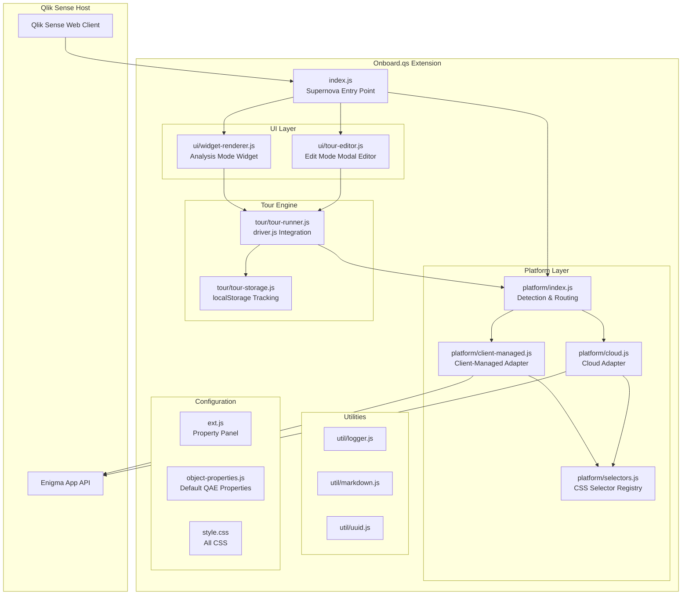
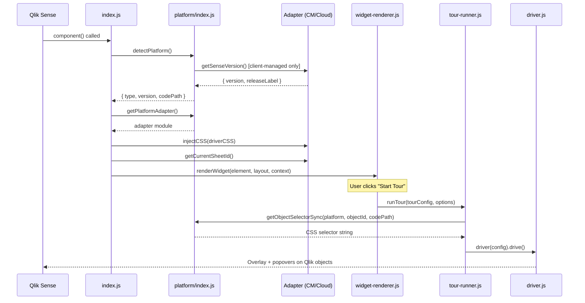
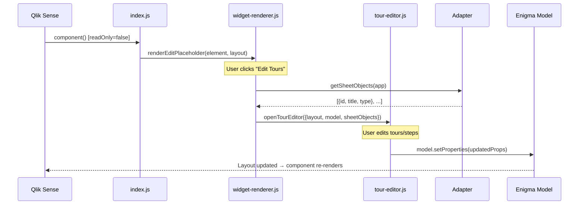
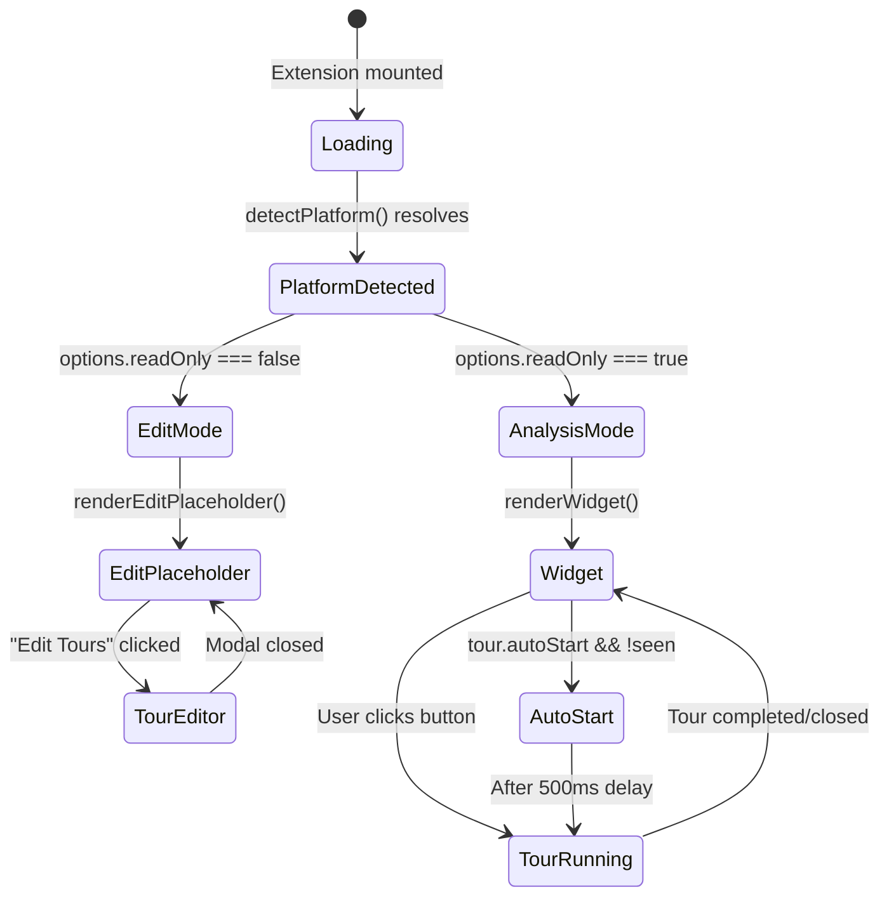

# Onboard.qs — Architecture Overview

This document describes the high-level architecture of the **Onboard.qs** Qlik Sense extension.

## What it does

Onboard.qs adds interactive, step-by-step onboarding tours to any Qlik Sense app. App developers configure tours in edit mode using a rich modal editor; end-users see a "Start Tour" button (or auto-started tours) in analysis mode. Tours highlight Qlik objects on the sheet with popovers powered by [driver.js](https://driverjs.com/).

## High-level component map



## Module responsibilities

| Module | Responsibility |
|---|---|
| `index.js` | Nebula/Stardust supernova entry point. Hooks into Qlik lifecycle (`useLayout`, `useApp`, etc.), detects platform once, delegates rendering. |
| `platform/index.js` | Detects whether running on Cloud or client-managed (URL-based). Resolves the correct adapter and Sense version. |
| `platform/client-managed.js` | Client-managed Qlik Sense adapter: sheet ID detection (URL → Qlik API → DOM), Engine API sheet objects, Sense version detection, version-range-to-code-path mapping. |
| `platform/cloud.js` | Qlik Cloud adapter: standalone implementation (no delegation to client-managed). Same interface, maintained independently. |
| `platform/selectors.js` | Single-source-of-truth CSS selector registry. Maps `(platform, codePath)` → selector functions. |
| `tour/tour-runner.js` | Transforms tour config into driver.js steps, launches tours, handles highlight preview. |
| `tour/tour-storage.js` | localStorage-based tracking of "has user seen this tour version". |
| `ui/widget-renderer.js` | Renders the analysis-mode UI: "Start Tour" button, multi-tour dropdown, auto-start logic. |
| `ui/tour-editor.js` | Full-screen modal editor for creating/editing tours and steps in edit mode. |
| `ext.js` | Qlik property panel definition. Provides a hybrid approach (property panel + modal editor). |
| `object-properties.js` | Default QAE properties for new extension instances. |
| `util/logger.js` | Build-aware logger (`debug` suppressed in production). Exposes `BUILD_TYPE` and `PACKAGE_VERSION`. |
| `util/markdown.js` | Minimal Markdown-to-HTML converter (~60 lines) for tour step descriptions. |
| `util/uuid.js` | UUID v4 generator for tour/step IDs. |
| `style.css` | All CSS: widget, editor, buttons, driver.js theme overrides, Cloud z-index fixes. |

## Data flow: analysis mode



## Data flow: edit mode



## Extension lifecycle



## File tree

```
src/
├── index.js                  # Supernova entry point
├── ext.js                    # Property panel definition
├── object-properties.js      # Default QAE properties
├── style.css                 # All CSS
├── data.js                   # Data targets (empty)
├── meta.json                 # nebula sense metadata
├── platform/
│   ├── index.js              # Platform detection & routing
│   ├── client-managed.js     # Client-managed adapter
│   ├── cloud.js              # Cloud adapter (standalone)
│   └── selectors.js          # CSS selector registry
├── tour/
│   ├── tour-runner.js        # driver.js integration
│   └── tour-storage.js       # localStorage tracking
├── ui/
│   ├── widget-renderer.js    # Analysis mode widget
│   └── tour-editor.js        # Edit mode modal editor
└── util/
    ├── logger.js             # Build-aware logging
    ├── markdown.js           # Minimal MD→HTML
    └── uuid.js               # UUID v4 generator
```
