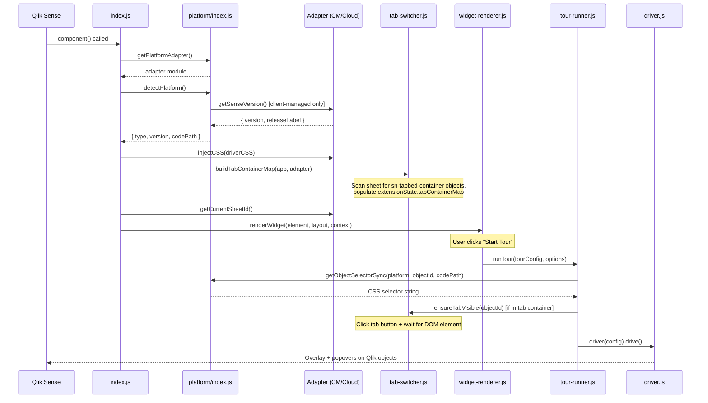
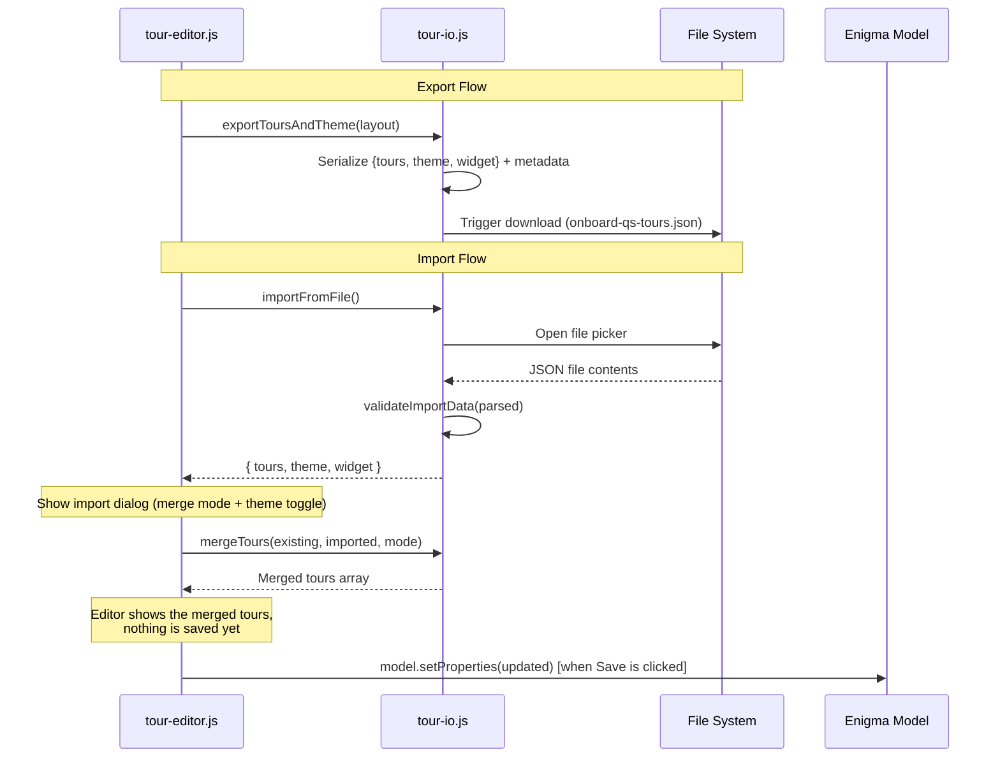
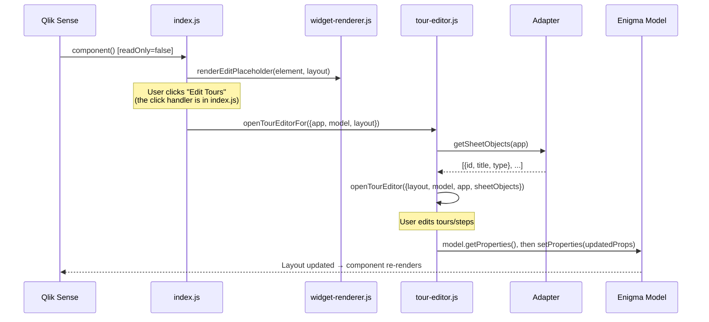
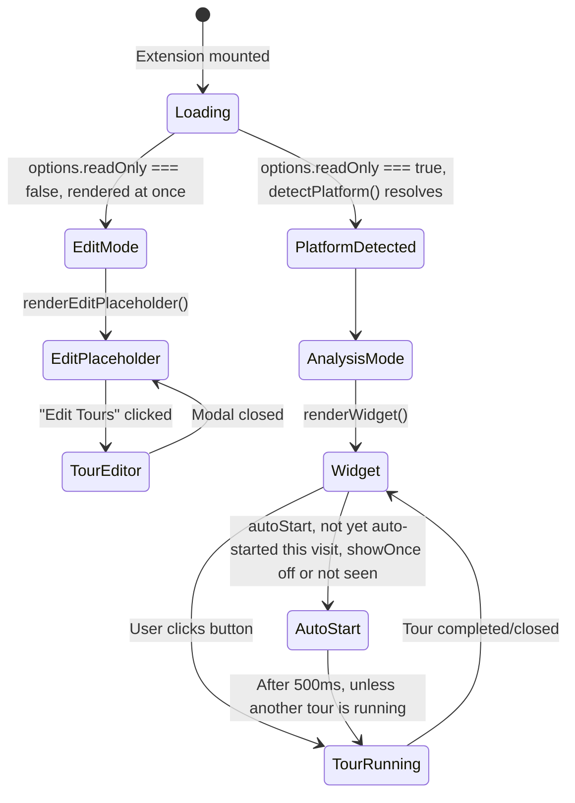

# Onboard.qs — Architecture Overview

This document describes the high-level architecture of the **Onboard.qs** Qlik Sense extension.

## What it does

Onboard.qs adds interactive, step-by-step onboarding tours to any Qlik Sense app. App developers configure tours in edit mode using a rich modal editor; end-users see a "Start Tour" button (or auto-started tours) in analysis mode. Tours highlight Qlik objects on the sheet with popovers powered by [driver.js](https://driverjs.com/).

## High-level component map


```mermaid
graph TD
    subgraph "Qlik Sense Host"
        QS[Qlik Sense Web Client]
        EA[Enigma App API]
    end

    subgraph "Onboard.qs Extension"
        EP[index.js<br/>Supernova Entry Point]

        subgraph "Platform Layer"
            PI[platform/index.js<br/>Detection & Routing]
            CM[platform/client-managed.js<br/>Client-Managed Adapter]
            CL[platform/cloud.js<br/>Cloud Adapter]
            SE[platform/selectors.js<br/>CSS Selector Registry]
        end

        subgraph "Tour Engine"
            TR[tour/tour-runner.js<br/>driver.js Integration]
            TU[tour/tour-helpers.js<br/>Tour Start & Auto-start]
            TS[tour/tour-storage.js<br/>localStorage Tracking]
            TI[tour/tour-io.js<br/>Import/Export]
        end

        subgraph "UI Layer"
            WR[ui/widget-renderer.js<br/>Analysis Mode Widget]
            TBI[ui/toolbar-injector.js<br/>Toolbar Button]
            TE[ui/tour-editor.js<br/>Edit Mode Modal Editor]
            MED[ui/markdown-editor-dialog.js<br/>Markdown Editor Dialog]
            MT[ui/markdown-toolbar.js<br/>Write / Preview Editor]
            CD[ui/confirm-discard.js<br/>Unsaved-Changes Dialog]
        end

        subgraph "Theme Layer"
            TH[theme/resolve.js<br/>Preset + Override Resolver]
            TP[theme/presets.js<br/>Built-in Theme Presets]
        end

        subgraph "Utilities"
            LG[util/logger.js]
            MD[util/markdown.js]
            MS[util/markdown-shortcuts.js]
            UU[util/uuid.js]
            EXP[util/expressions.js]
            VI[util/visibility.js]
            CS[util/css-selector.js]
            DS[util/dialog-size.js]
            SA[util/sanitize.js]
            XS[util/extension-state.js<br/>Shared State]
            TB[util/tab-switcher.js<br/>Tab Container Support]
        end

        subgraph "Property Panel"
            EX[ext/index.js<br/>Property Panel Definition]
            PTS[ext/tours-section.js<br/>Tours]
            PWS[ext/widget-section.js<br/>Widget Appearance]
            PTH[ext/theme-section.js<br/>Theme & Styling]
            THH[ext/theme-helpers.js<br/>Theme Section Helpers]
            PSS[ext/security-section.js<br/>Security]
            PAS[ext/about-section.js<br/>About]
            LUI[ext/lui-icons.js<br/>Button Icons]
        end

        subgraph "Configuration"
            OP[object-properties.js<br/>Default QAE Properties]
            ST[style.css<br/>All CSS]
        end
    end

    QS --> EP
    EP --> PI
    PI --> CM
    PI --> CL
    CM --> SE
    CL --> SE
    CM --> EA
    CL --> EA
    EP --> WR
    EP --> TBI
    EP --> TE
    EP --> TU
    EP --> TH
    TH --> TP
    WR --> TU
    TBI --> TU
    TU --> TR
    TU --> TS
    TR --> TS
    TE --> TR
    TE --> TI
    TE --> MT
    TE --> CD
    MED --> MT
    MED --> CD
    TR --> TB
    TB --> XS
    TB --> SE
    EP --> TB
    TR --> PI
    EP --> EX
    EX --> PTS
    EX --> PWS
    EX --> PTH
    EX --> PSS
    EX --> PAS
    PTS --> TE
    PTS --> MED
    PWS --> LUI
    PTH --> THH
    THH --> TP
```

Each arrow is an import. The map shows the main ones only: it leaves out most imports of the `util/` modules, which are used across the code. The [module table](#module-responsibilities) says what each module is for.

## Module responsibilities

| Module                         | Responsibility                                                                                                                                                                                                                                                                                             |
| ------------------------------ | ---------------------------------------------------------------------------------------------------------------------------------------------------------------------------------------------------------------------------------------------------------------------------------------------------------- |
| `index.js`                     | Nebula/Stardust supernova entry point. Hooks into Qlik lifecycle (`useLayout`, `useApp`, etc.), detects platform once, delegates rendering.                                                                                                                                                                |
| `object-properties.js`         | Default QAE properties for new extension instances.                                                                                                                                                                                                                                                        |
| `style.css`                    | All CSS: widget, editor, buttons, driver.js theme overrides, Cloud z-index fixes, hover menu hiding.                                                                                                                                                                                                       |
| `ext/index.js`                 | Qlik property panel definition, assembled from the section modules below. Provides a hybrid approach (property panel + modal editor).                                                                                                                                                                      |
| `ext/tours-section.js`         | Tours section: tours and their steps, the **Open tour editor** button, the **Edit in Markdown editor** button, and the **Target object** dropdown. Its `getObjectList()` also builds the tab-container map and labels objects inside tab containers.                                                       |
| `ext/widget-section.js`        | Widget Appearance section: the start button's visibility, text, icon, style, alignment and size, the toolbar button, and the host UI toggles.                                                                                                                                                              |
| `ext/theme-section.js`         | Theme & Styling section: the preset, and overrides for the button, popover, progress bar and menu.                                                                                                                                                                                                         |
| `ext/theme-helpers.js`         | Helpers for the theme section: the color property keys, color-picker values, and the preset's value as placeholder.                                                                                                                                                                                        |
| `ext/security-section.js`      | Security section: the allowed URI prefixes for videos and iframes in step descriptions.                                                                                                                                                                                                                    |
| `ext/about-section.js`         | About section: version, build date and links.                                                                                                                                                                                                                                                              |
| `ext/lui-icons.js`             | The Lui icons offered for the start button's icon.                                                                                                                                                                                                                                                         |
| `platform/index.js`            | Detects whether running on Cloud or client-managed (URL-based). Resolves the correct adapter and Sense version.                                                                                                                                                                                            |
| `platform/client-managed.js`   | Client-managed Qlik Sense adapter: sheet ID detection (URL → Qlik API → DOM), Engine API sheet objects, Sense version detection, version-range-to-code-path mapping.                                                                                                                                       |
| `platform/cloud.js`            | Qlik Cloud adapter: standalone implementation (no delegation to client-managed). Same interface, maintained independently.                                                                                                                                                                                 |
| `platform/selectors.js`        | Single-source-of-truth CSS selector registry. Maps `(platform, codePath)` → selector functions.                                                                                                                                                                                                            |
| `tour/tour-runner.js`          | Transforms tour config into driver.js steps, launches tours, handles highlight preview.                                                                                                                                                                                                                    |
| `tour/tour-helpers.js`         | Starts tours for the widget and the toolbar button (`startTour()`), and decides which tours auto-start (`handleAutoStart()`): at most once per sheet visit, and with **Show only once** on only until the tour is seen. The visit belongs to the sheet, not the object, and `endAutoStartVisit()` ends it. |
| `tour/tour-storage.js`         | localStorage-based tracking of "has user seen this tour version".                                                                                                                                                                                                                                          |
| `tour/tour-io.js`              | Tour import/export: serializes tours + theme + widget to JSON, imports with validation, supports three merge modes (Replace Matching, Replace All, Add to Existing).                                                                                                                                       |
| `theme/resolve.js`             | Theme resolver. Merges a preset's defaults with per-property overrides from the layout, producing a flat map of CSS custom-property name → value. Also provides `applyThemeToElement()`, `buildPopoverThemeCSS()`, and `injectThemeStyle()`.                                                               |
| `theme/presets.js`             | Built-in theme presets (Default, The Lean Green Machine, Corporate Blue, Corporate Gold). Each preset defines all color, size, and font values.                                                                                                                                                            |
| `ui/widget-renderer.js`        | Renders the analysis-mode UI: "Start Tour" button and multi-tour dropdown, for the tours whose show condition holds. Hands auto-start to `tour-helpers.js`.                                                                                                                                                |
| `ui/toolbar-injector.js`       | With **Show toolbar button** on, puts a tour button in the Sense toolbar. Merges the visible tours of every Onboard.qs object on the sheet into one button or dropdown, and puts it back after sheet changes.                                                                                              |
| `ui/tour-editor.js`            | Full-screen modal editor for creating/editing tours and steps in edit mode.                                                                                                                                                                                                                                |
| `ui/confirm-discard.js`        | Asks whether to discard unsaved changes. Used by the tour editor and the Markdown editor dialog.                                                                                                                                                                                                           |
| `ui/markdown-editor-dialog.js` | The larger Markdown editor that the property panel's **Edit in Markdown editor** button opens for a step description.                                                                                                                                                                                      |
| `ui/markdown-toolbar.js`       | Tabbed Write / Preview Markdown editor with a formatting toolbar, shared by the tour editor and the Markdown editor dialog.                                                                                                                                                                                |
| `util/css-selector.js`         | Checks that a step's CSS selector parses. The tour runner gives an unparseable one no element instead of throwing, and the property panel warns about one typed in.                                                                                                                                        |
| `util/dialog-size.js`          | Dialog-size presets for steps: the list the property panel and the tour editor offer, and the size the tour runner applies.                                                                                                                                                                                |
| `util/expressions.js`          | Expression values: shows `qStringExpression` and `qValueExpression` properties as `=expr` in the tour editor and the Markdown editor dialog, and stores text starting with `=` as an expression again.                                                                                                     |
| `util/extension-state.js`      | Shared mutable state: the model and app of the Onboard.qs object rendered last, the tab-container map, and a promise that resolves once the map is built.                                                                                                                                                  |
| `util/logger.js`               | Build-aware logger (`debug` suppressed in production). Exposes `BUILD_TYPE` and `PACKAGE_VERSION`.                                                                                                                                                                                                         |
| `util/markdown.js`             | Minimal Markdown-to-HTML converter for tour step descriptions, with raw HTML blocks as in CommonMark.                                                                                                                                                                                                      |
| `util/markdown-shortcuts.js`   | GitHub-style keyboard shortcuts for Markdown textareas.                                                                                                                                                                                                                                                    |
| `util/sanitize.js`             | Checks Lui icon names, so a configured icon can't inject CSS classes.                                                                                                                                                                                                                                      |
| `util/tab-switcher.js`         | Tab container support: builds the tab-container map, and switches to a step's tab before the step is shown. See [Tab container support](TOUR-SYSTEM.md#tab-container-support).                                                                                                                             |
| `util/uuid.js`                 | UUID v4 generator for tour/step IDs.                                                                                                                                                                                                                                                                       |
| `util/visibility.js`           | Evaluates the show condition of a tour or step: hidden for `0`, `'0'` and `'false'` (in any case), shown otherwise.                                                                                                                                                                                        |

## Data flow: analysis mode


```mermaid
sequenceDiagram
    participant QS as Qlik Sense
    participant EP as index.js
    participant PI as platform/index.js
    participant AD as Adapter (CM/Cloud)
    participant TB as tab-switcher.js
    participant WR as widget-renderer.js
    participant TR as tour-runner.js
    participant DJ as driver.js

    QS->>EP: component() called
    EP->>PI: getPlatformAdapter()
    PI-->>EP: adapter module
    EP->>PI: detectPlatform()
    PI->>AD: getSenseVersion() [client-managed only]
    AD-->>PI: { version, releaseLabel }
    PI-->>EP: { type, version, codePath }
    EP->>AD: injectCSS(driverCSS)
    EP->>TB: buildTabContainerMap(app, adapter)
    Note over TB: Scan sheet for sn-tabbed-container objects,<br/>populate extensionState.tabContainerMap
    EP->>AD: getCurrentSheetId()
    EP->>WR: renderWidget(element, layout, context)
    Note over WR: User clicks "Start Tour"
    WR->>TR: runTour(tourConfig, options)
    TR->>PI: getObjectSelectorSync(platform, objectId, codePath)
    PI-->>TR: CSS selector string
    TR->>TB: ensureTabVisible(objectId) [if in tab container]
    Note over TB: Click tab button + wait for DOM element
    TR->>DJ: driver(config).drive()
    DJ-->>QS: Overlay + popovers on Qlik objects
```

## Data flow: tour import/export


```mermaid
sequenceDiagram
    participant TE as tour-editor.js
    participant IO as tour-io.js
    participant FS as File System
    participant MD as Enigma Model

    Note over TE,FS: Export Flow
    TE->>IO: exportToursAndTheme(layout)
    IO->>IO: Serialize {tours, theme, widget} + metadata
    IO->>FS: Trigger download (onboard-qs-tours.json)

    Note over TE,FS: Import Flow
    TE->>IO: importFromFile()
    IO->>FS: Open file picker
    FS-->>IO: JSON file contents
    IO->>IO: validateImportData(parsed)
    IO-->>TE: { tours, theme, widget }
    Note over TE: Show import dialog (merge mode + theme toggle)
    TE->>IO: mergeTours(existing, imported, mode)
    IO-->>TE: Merged tours array
    Note over TE: Editor shows the merged tours,<br/>nothing is saved yet
    TE->>MD: model.setProperties(updated) [when Save is clicked]
```

## Data flow: edit mode


```mermaid
sequenceDiagram
    participant QS as Qlik Sense
    participant EP as index.js
    participant WR as widget-renderer.js
    participant TE as tour-editor.js
    participant AD as Adapter
    participant MD as Enigma Model

    QS->>EP: component() [readOnly=false]
    EP->>WR: renderEditPlaceholder(element, layout)
    Note over EP: User clicks "Edit Tours"<br/>(the click handler is in index.js)
    EP->>TE: openTourEditorFor({app, model, layout})
    TE->>AD: getSheetObjects(app)
    AD-->>TE: [{id, title, type}, ...]
    TE->>TE: openTourEditor({layout, model, app, sheetObjects})
    Note over TE: User edits tours/steps
    TE->>MD: model.getProperties(), then setProperties(updatedProps)
    MD-->>QS: Layout updated → component re-renders
```

## Extension lifecycle


```mermaid
stateDiagram-v2
    [*] --> Loading: Extension mounted
    Loading --> EditMode: options.readOnly === false, rendered at once
    Loading --> PlatformDetected: options.readOnly === true, detectPlatform() resolves
    PlatformDetected --> AnalysisMode

    EditMode --> EditPlaceholder: renderEditPlaceholder()
    EditPlaceholder --> TourEditor: "Edit Tours" clicked
    TourEditor --> EditPlaceholder: Modal closed

    AnalysisMode --> Widget: renderWidget()
    Widget --> AutoStart: autoStart, not yet auto-started this visit, showOnce off or not seen
    Widget --> TourRunning: User clicks button
    AutoStart --> TourRunning: After 500ms, unless another tour is running
    TourRunning --> Widget: Tour completed/closed
```

Edit mode doesn't wait for platform detection: `index.js` renders the placeholder straight away. When `options.readOnly` isn't set yet, an `/edit` URL counts as edit mode.

The auto-start rule in full: a tour with **Auto-start** on starts by itself at most once per visit to the sheet. With **Show only once** off it does so on every visit, and with it on only until the user has seen the tour's current version. See [When a tour starts by itself](../README.md#when-a-tour-starts-by-itself) in the README, and [Auto-start tours](TOUR-SYSTEM.md#auto-start-tours) for how a visit is tracked.

## File tree

```
src/
├── index.js                  # Supernova entry point
├── object-properties.js      # Default QAE properties
├── style.css                 # All CSS
├── meta.json                 # nebula sense metadata
├── ext/
│   ├── index.js              # Property panel definition
│   ├── tours-section.js      # Tours section, target-object dropdown (getObjectList)
│   ├── widget-section.js     # Widget Appearance section
│   ├── theme-section.js      # Theme & Styling section
│   ├── theme-helpers.js      # Color keys and preset helpers for the theme section
│   ├── security-section.js   # Security section (URI allowlist)
│   ├── about-section.js      # About section
│   └── lui-icons.js          # Lui icons for the button icon picker
├── platform/
│   ├── index.js              # Platform detection & routing
│   ├── client-managed.js     # Client-managed adapter
│   ├── cloud.js              # Cloud adapter (standalone)
│   └── selectors.js          # CSS selector registry
├── tour/
│   ├── tour-runner.js        # driver.js integration
│   ├── tour-helpers.js       # startTour(), auto-start and sheet visits
│   ├── tour-storage.js       # localStorage tracking
│   └── tour-io.js            # Tour import/export (JSON, merge modes)
├── theme/
│   ├── resolve.js            # Theme resolver (preset + overrides → CSS vars)
│   └── presets.js            # Built-in theme presets (4)
├── ui/
│   ├── widget-renderer.js    # Analysis mode widget
│   ├── toolbar-injector.js   # Tour button in the Sense toolbar
│   ├── tour-editor.js        # Edit mode modal editor
│   ├── confirm-discard.js    # Unsaved-changes confirmation dialog
│   ├── markdown-editor-dialog.js # Property panel's Markdown editor dialog
│   └── markdown-toolbar.js   # Tabbed Write/Preview Markdown editor
└── util/
    ├── css-selector.js       # Checks for step CSS selectors
    ├── dialog-size.js        # Dialog-size presets for steps
    ├── expressions.js        # Qlik expression values (=expr ↔ qStringExpression)
    ├── extension-state.js    # Shared state (model and app refs, tabContainerMap)
    ├── logger.js             # Build-aware logging
    ├── markdown.js           # Minimal MD→HTML
    ├── markdown-shortcuts.js # Markdown keyboard shortcuts
    ├── sanitize.js           # Lui icon name sanitizer
    ├── tab-switcher.js       # Tab container auto-switching
    ├── uuid.js               # UUID v4 generator
    └── visibility.js         # Show conditions of tours and steps
```
