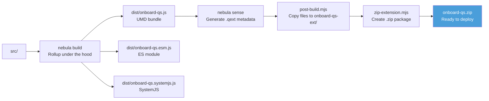
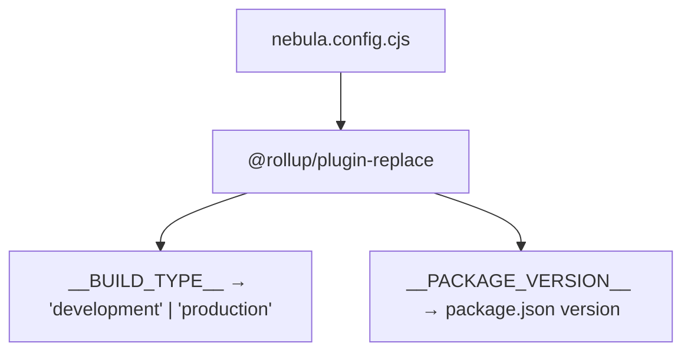
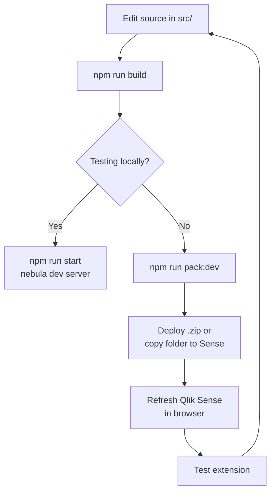
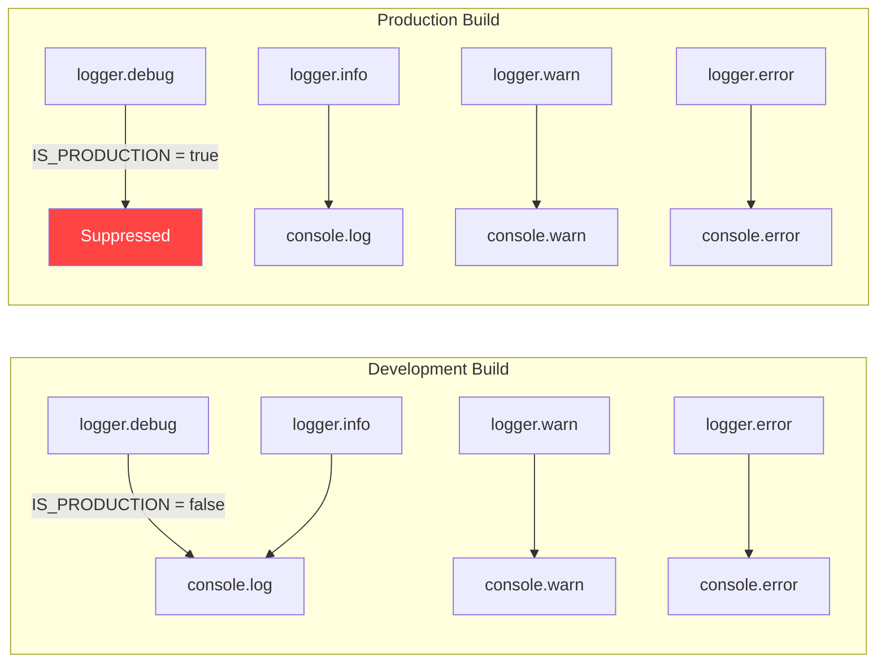

# Build & Deployment

Onboard.qs uses the [nebula.js](https://qlik.dev/toolkits/nebulajs/) build toolchain to produce a Qlik Sense extension package (`.zip`).

## Build toolchain



## npm scripts

| Script | Purpose |
|---|---|
| `npm run build` | Development build (unminified, sourcemaps off) |
| `npm run build:dist` | Production build (minified) |
| `npm run pack:dev` | Full pipeline: build → sense → post-build → zip (development) |
| `npm run pack:prod` | Full pipeline: build → sense → post-build → zip (production) |
| `npm run start` | Start nebula dev server for local development |
| `npm run lint` | Run ESLint on `src/` and `scripts/` |
| `npm run lint:fix` | Run ESLint with auto-fix |
| `npm run format` | Format all files with Prettier |
| `npm run format:check` | Check formatting without modifying files |
| `npm run version:major` | Bump major version (no git tag) |
| `npm run version:minor` | Bump minor version (no git tag) |
| `npm run version:patch` | Bump patch version (no git tag) |

## Build configuration

### nebula.config.cjs

The nebula build config (`nebula.config.cjs`) customizes the Rollup pipeline:



These compile-time constants control:
- **`__BUILD_TYPE__`** — Used by `logger.js` to suppress `debug()` output in production builds.
- **`__PACKAGE_VERSION__`** — Displayed in the property panel header.

### Important constraint: no dynamic imports

The Rollup UMD bundle must be a single file (Qlik Sense loads extensions as single scripts). This means:

- **No `import()` calls** — they would create code-split chunks, breaking the single-file requirement.
- Both platform adapters (`client-managed.js` and `cloud.js`) are **statically imported** via `import * as` in `platform/index.js`.
- The correct adapter is selected at runtime based on URL detection, NOT at build time.

## Output structure

After `npm run pack:dev`:

```
onboard-qs-ext/
├── onboard-qs.js       # UMD bundle (Qlik loads this)
├── onboard-qs.qext     # Qlik extension manifest
└── (other metadata)

onboard-qs.zip           # Deployable package
```

## Deployment

### Client-managed (Qlik Sense Enterprise on Windows)

1. Build: `npm run pack:prod`
2. Import the `.zip` via QMC → Extensions, or copy the `onboard-qs-ext/` folder to `C:\Qlik\Sense\Extensions\onboard-qs\`

### Qlik Cloud

1. Build: `npm run pack:prod`
2. Upload the `.zip` via Management Console → Extensions

## Extension manifest (.qext)

Generated by `nebula sense`, the `.qext` file tells Qlik Sense how to load the extension:

```json
{
    "name": "onboard-qs",
    "description": "Interactive onboarding tours for Qlik Sense",
    "type": "visualization",
    "version": "1.1.1"
}
```

## Development workflow



### Local development with nebula serve

`npm run start` launches a local dev server with hot reload. This is useful for testing the extension's rendering without deploying to a Qlik Sense server, but it does not provide a full Qlik Sense environment (no Enigma API, no real sheets).

## Dependencies

### Runtime

| Package | Purpose |
|---|---|
| `driver.js` | Tour overlay engine |

### Build-time

| Package | Purpose |
|---|---|
| `@nebula.js/cli-build` | Rollup-based build |
| `@nebula.js/cli-sense` | Generate `.qext` metadata |
| `@rollup/plugin-replace` | Compile-time constants |
| `cross-env` | Cross-platform env vars |
| `archiver` | Zip creation |
| `eslint` + plugins | Linting |
| `prettier` | Code formatting |

## Logging in builds



The `BUILD_TYPE` constant is replaced at build time by `@rollup/plugin-replace`, so the production bundle physically cannot log debug messages — the dead code is eliminated by Rollup's tree-shaking.
