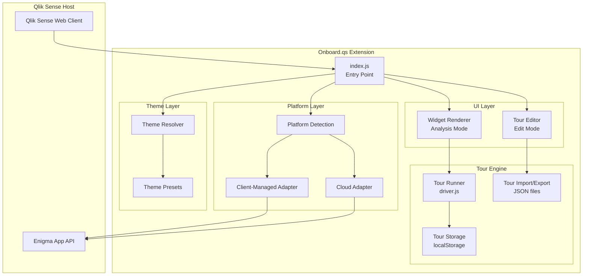
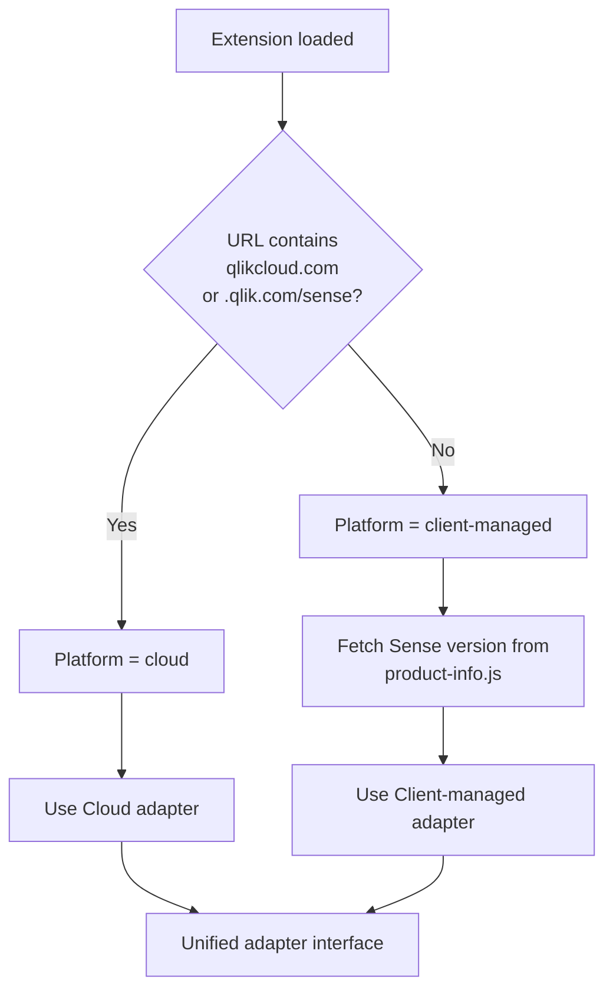

# Development Guide

This document covers building, extending, and contributing to the Onboard.qs extension.  
For **installation and usage**, see the main [README](../README.md).

---

## Prerequisites

- Node.js ≥ 18.10 and npm
- Git

## Getting the Source

```bash
git clone https://github.com/ptarmiganlabs/onboard.qs.git
cd onboard.qs
npm install
```

## Build Commands

| Command                | Description                                                   |
| ---------------------- | ------------------------------------------------------------- |
| `npm run pack:dev`     | Development build → `onboard-qs.zip` (with logging)           |
| `npm run pack:prod`    | Production build → `onboard-qs.zip` (minified, no debug logs) |
| `npm run build`        | Build only (no zip)                                           |
| `npm run lint`         | ESLint check                                                  |
| `npm run lint:fix`     | ESLint auto-fix                                               |
| `npm run format`       | Format all files with Prettier                                |
| `npm run format:check` | Check formatting without modifying files                      |
| `npm run start`        | nebula serve (local dev mode)                                 |
| `npm run cloc`         | Count lines of code                                           |

The `pack:prod` script is the main build pipeline: it runs `nebula build` (Rollup bundle), `nebula sense` (metadata generation), `post-build` (token replacement for version/build-type), and `zip-extension` (creates `onboard-qs.zip`).

For full details on the build toolchain, see [BUILD-AND-DEPLOYMENT.md](BUILD-AND-DEPLOYMENT.md).

---

## Project Structure

```text
onboard.qs/
├── package.json              # Project manifest, scripts, dependencies
├── nebula.config.cjs         # nebula.js / Rollup build configuration
├── eslint.config.js          # ESLint flat config
├── scripts/
│   ├── post-build.mjs        # Token replacement (version, build type)
│   └── zip-extension.mjs     # Zip builder for Sense deployment
└── src/
    ├── index.js              # Supernova entry point (hooks, lifecycle)
    ├── ext.js                # Property panel definition
    ├── object-properties.js  # Default object properties
    ├── data.js               # Data targets (empty — no data binding)
    ├── meta.json             # Extension metadata (name, icon, type)
    ├── style.css             # All CSS: widget, editor, driver.js theme
    ├── platform/
    │   ├── index.js          # Platform detection + selector helper
    │   ├── selectors.js      # Versioned CSS selector registry
    │   ├── client-managed.js # Client-managed Sense DOM helpers
    │   └── cloud.js          # Qlik Cloud adapter
    ├── tour/
    │   ├── tour-runner.js    # driver.js integration: build steps, run/highlight/destroy
    │   ├── tour-storage.js   # localStorage "show once" tracking
    │   └── tour-io.js        # Tour import/export (JSON serialization, merge modes)
    ├── theme/
    │   ├── resolve.js        # Theme resolver (preset + overrides → CSS vars)
    │   └── presets.js        # Built-in theme presets (4 presets)
    ├── ui/
    │   ├── widget-renderer.js # Analysis mode: button, dropdown, auto-start
    │   └── tour-editor.js    # Full-screen modal editor (3-panel layout)
    └── util/
        ├── logger.js         # Build-type-aware console logger
        ├── markdown.js       # Mini Markdown-to-HTML converter
        └── uuid.js           # UUID v4 generator
```

---

## How It Works

1. **Edit mode**: The extension renders an "Open Tour Editor" placeholder. Clicking it opens a full-screen modal with three panels — tour list, step list, and detail editor. Alternatively, use the Qlik property panel on the right.

2. **Analysis mode**: The extension renders a start button (or auto-starts). When triggered, it builds a driver.js configuration from the saved tour steps, resolving sheet objects to live DOM elements via CSS class selectors (`.qv-object-{objectId}`), and runs the tour.

3. **Show-once**: When a tour completes or is dismissed, a localStorage key (`onboard-qs:{appId}:{sheetId}:{tourId}:v{version}`) is written. Auto-start checks this key and skips if present.

4. **Markdown**: Step descriptions are converted from Markdown to HTML by a built-in mini parser ([src/util/markdown.js](../src/util/markdown.js)) before being passed to driver.js popovers.

### Architecture Overview

The following diagram shows how the major components interact:



For a detailed architecture breakdown, see [ARCHITECTURE.md](ARCHITECTURE.md).

---

## Platform Detection

Platform detection is **automatic** — the extension checks `window.location.href` at startup to determine whether it is running on Qlik Cloud or client-managed Qlik Sense:



Both platforms share an identical adapter interface:

| Function                     | Description                                              |
| ---------------------------- | -------------------------------------------------------- |
| `getCurrentSheetId()`        | Get the active sheet ID (URL parsing + API fallbacks)    |
| `getSheetObjects(app)`       | List objects on the current sheet via Engine API          |
| `getObjectSelector(objectId)`| Get the CSS selector for a Qlik object                   |
| `isEditMode(options)`        | Check if in edit mode                                    |
| `injectCSS(css, id)`        | Inject a `<style>` element into the page                 |

The client-managed adapter additionally detects the running Sense version and maps it to a "code path" for version-specific CSS selector overrides. See [PLATFORM-DETECTION.md](PLATFORM-DETECTION.md) for full details.

---

## Dependencies

| Package                                   | Purpose                                          | Size       |
| ----------------------------------------- | ------------------------------------------------ | ---------- |
| [driver.js](https://driverjs.com/) ^1.3.1 | Tour engine (highlighting, popovers, animations) | ~5 KB gzip |

All other dependencies are dev-only (build tooling).

---

## Further Reading

| Document | Description |
| --- | --- |
| [ARCHITECTURE.md](ARCHITECTURE.md) | Component map, data flow, supernova lifecycle, module-by-module breakdown |
| [BUILD-AND-DEPLOYMENT.md](BUILD-AND-DEPLOYMENT.md) | Build toolchain, npm scripts, post-build processing, deployment |
| [PLATFORM-DETECTION.md](PLATFORM-DETECTION.md) | Platform detection, version fetching, adapter interface |
| [SELECTORS.md](SELECTORS.md) | CSS selector registry design, per-platform/version lookup |
| [TOUR-SYSTEM.md](TOUR-SYSTEM.md) | Tour data model, step resolution, driver.js integration, import/export |
| [VIRUS-SCAN.md](VIRUS-SCAN.md) | VirusTotal scanning of release artifacts |
