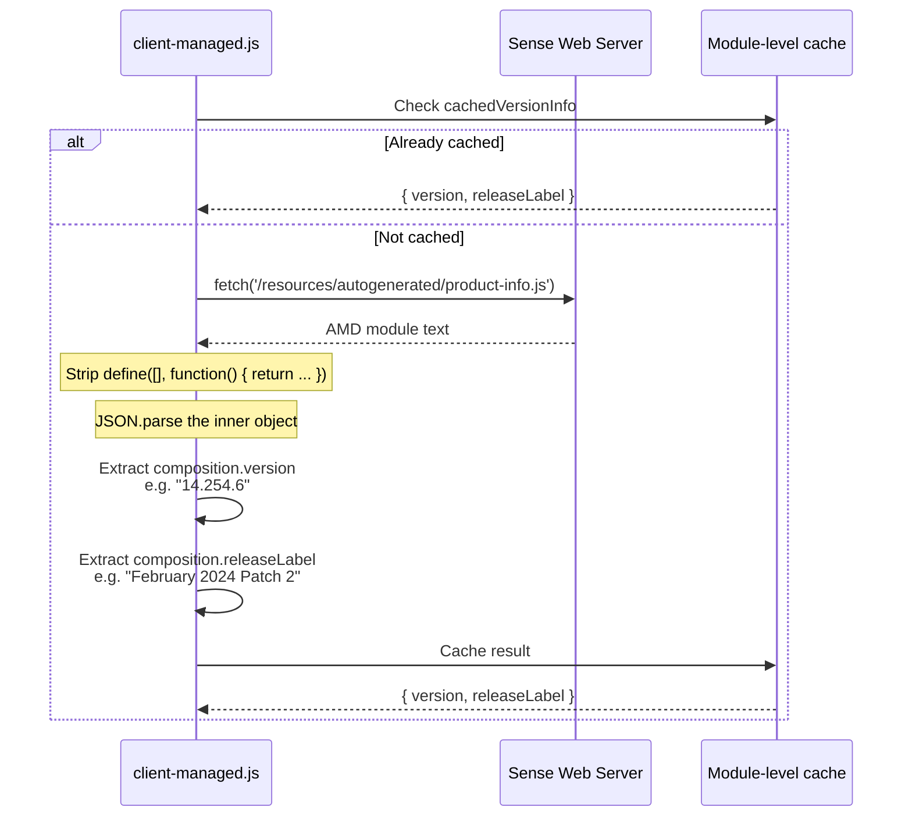
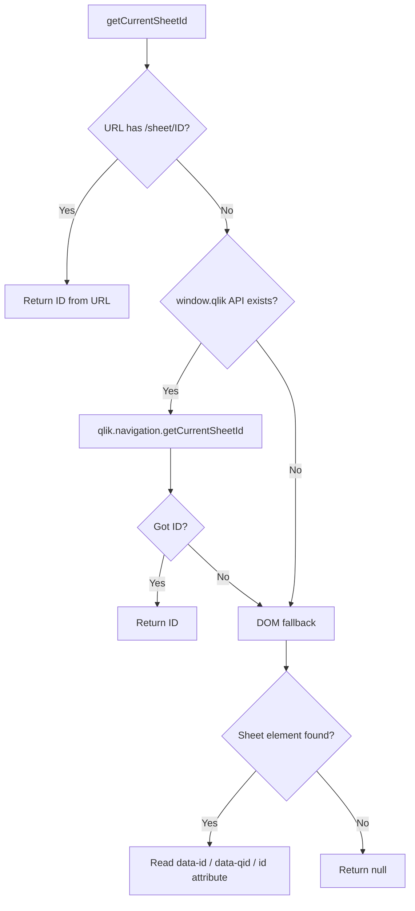

# Platform Detection & Adapter System

Onboard.qs runs on two distinct Qlik platforms — **client-managed** (Qlik Sense Enterprise on Windows) and **Qlik Cloud**. The platform layer provides a unified interface while keeping platform-specific code strictly separated.

## Design principles

1. **Separate code paths** — Cloud and client-managed are standalone modules. Cloud does NOT delegate to client-managed. Either platform can change independently without breaking the other.
2. **Version-aware client-managed** — The client-managed adapter detects the running Sense version and maps it to a "code path" name, enabling version-specific selector overrides.
3. **Single-file bundle** — Both adapters are statically imported (no dynamic `import()`) so the Rollup UMD bundle remains one file. Tree-shaking is not a concern since both adapters are small.

## Detection flow

```mermaid
flowchart TD
    A[Extension loaded] --> B{URL matches<br/>qlikcloud.com?}
    B -- Yes --> C[Platform = cloud]
    B -- No --> D[Platform = client-managed]

    C --> E[codePath = 'default'<br/>version = null]

    D --> F[Fetch /resources/autogenerated/<br/>product-info.js]
    F -- Success --> G[Parse AMD wrapper<br/>Extract composition.version]
    G --> H[resolveCodePath&#40;version&#41;]
    H --> I[Match version against<br/>versionRanges array]
    I -- Match found --> J[codePath = matched range name]
    I -- No match --> K[codePath = 'default']

    F -- Fetch failed --> K

    E --> L[Return platform info]
    J --> L
    K --> L

    style C fill:#4a9eda,color:#fff
    style D fill:#e8a838,color:#fff
```



## Platform detection functions

### `detectPlatformType()` — synchronous

Simple URL regex check. Used when only the platform type is needed (no version info).

```
qlikcloud.com  →  'cloud'
.qlik.com/sense  →  'cloud'
everything else  →  'client-managed'
```

### `detectPlatform()` — async

Full detection including version. Called once at startup, result is cached in `platformRef`.

Returns: `{ type, version, codePath }`

| Platform | `type` | `version` | `codePath` |
|---|---|---|---|
| Cloud | `'cloud'` | `null` | `'default'` |
| Client-managed | `'client-managed'` | e.g. `'14.254.6'` | e.g. `'default'` |

### `getPlatformAdapter()` — synchronous

Returns the statically-imported adapter module matching the current platform URL.

## Sense version detection (client-managed only)



The `/resources/autogenerated/product-info.js` file is an AMD module present in all Qlik Sense Enterprise on Windows installations. Its structure:

```javascript
define([], function() {
    return {
        composition: {
            version: "14.254.6",
            releaseLabel: "February 2024 Patch 2",
            // ... other fields
        }
    };
});
```

The extension strips the AMD wrapper with a regex, parses the JSON payload, and caches the result for the session.

## Code-path resolution

Code paths allow the extension to use different CSS selectors for different Sense versions. This is necessary because Qlik periodically changes its DOM structure.

```mermaid
flowchart LR
    V[Sense version<br/>e.g. "14.254.6"] --> R[resolveCodePath]
    R --> VR[versionRanges array]
    VR --> |"v >= min && v <= max"| CP[Code path name]
    VR --> |No range matched| DF["'default'"]
    CP --> S[selectors.js<br/>getSelectors&#40;platform, codePath&#41;]
    DF --> S
```

### Version range format

```javascript
const versionRanges = [
    // { minVersion: '15.0.0', maxVersion: '99.999.999', codePath: 'future' },
];
```

- Ranges are evaluated top-to-bottom; first match wins.
- Comparison is simple semver: `major.minor.patch` numeric.
- If no range matches (or version is `null`), `'default'` is returned.
- Currently the array is empty — all versions use `'default'`. Add entries when Qlik ships a breaking DOM change.

## Adapter interface

Both `client-managed.js` and `cloud.js` export the same functions:

| Function | Signature | Description |
|---|---|---|
| `getCurrentSheetId()` | `() → string \| null` | Get the active sheet ID |
| `getSheetObjects(app)` | `(app) → Promise<Array>` | List objects on the current sheet via Engine API |
| `getObjectSelector(objectId, codePath?)` | `(string, string?) → string` | Get CSS selector for a Qlik object |
| `isEditMode(options)` | `(options) → boolean` | Check if in edit mode |
| `injectCSS(css, id)` | `(string, string) → void` | Inject a `<style>` element into `<head>` |

Client-managed additionally exports:
- `getSenseVersion()` — async, fetches and caches version info
- `resolveCodePath(version)` — maps version to a code-path name

## Sheet ID detection strategies

### Client-managed



### Cloud

Cloud only uses URL parsing (`/sheet/ID` pattern). There is no `window.qlik` global API in Cloud.

## Sheet objects retrieval (Engine API)

Both adapters use the same Engine API flow, maintained independently:

```mermaid
flowchart TD
    A[getSheetObjects&#40;app&#41;] --> B[app.getAllInfos]
    B --> C{Sheet ID known?}
    C -- Yes --> D[app.getObject&#40;sheetId&#41;]
    D --> E[sheetObj.getLayout]
    E --> F[Extract cells[].name +<br/>qChildList.qItems[].qInfo.qId]
    F --> G[Filter infos to sheet objects only]
    C -- No --> H[Use all infos]
    G --> I[Exclude system types<br/>sheet, story, appprops, etc.]
    H --> I
    I --> J{< 100 objects?}
    J -- Yes --> K[Enrich titles via<br/>getObject + getLayout per obj]
    J -- No --> L[Skip enrichment]
    K --> M[Sort by title, return]
    L --> M
```
