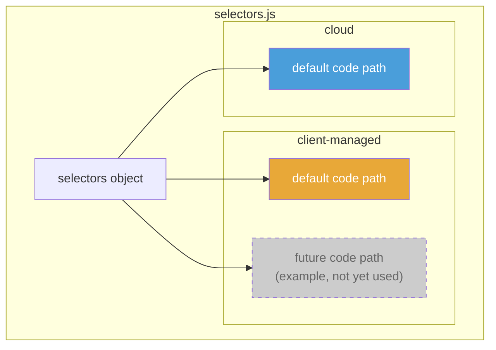
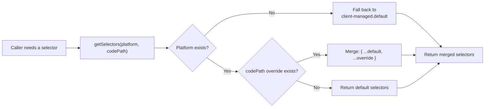
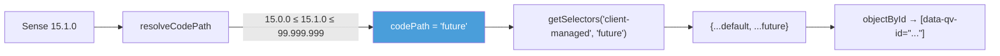

# CSS Selector Registry

The selector registry (`platform/selectors.js`) is the **single source of truth** for all CSS selectors used to locate Qlik Sense DOM elements. When the Qlik client DOM changes, only this file needs updating.

## Why a registry?

Qlik Sense's DOM structure differs between:

- **Client-managed vs Cloud** — different toolbar elements, different layout containers.
- **Sense versions** — Qlik periodically restructures its DOM classes and attributes.

Hardcoding selectors throughout the codebase would make DOM changes painful. Instead, all selectors live in one place and are accessed through `getSelectors(platform, codePath)`.

## Registry structure



## Selector lookup flow



The merge strategy means overrides only need to specify the selectors that **changed** — everything else is inherited from `default`.

## Current selectors

### Client-managed — `default`

| Selector | Value | Usage |
|---|---|---|
| `objectById(id)` | `.qv-object-${id}` | Tour step targeting |
| `allObjects` | `.qv-object` | Enumerate all objects |
| `sheetContainer` | `.qv-sheet, .qv-panel-sheet, .qv-panel-content` | Sheet container detection |
| `sheetTitle` | `.sheet-title-container, .qs-sheet-title` | Sheet title area |
| `toolbar` | `.qv-toolbar-container, .qs-toolbar` | Qlik toolbar |
| `gridCell` | `.qv-gridcell` | Grid cells wrapping objects |

### Cloud — `default`

| Selector | Value | Usage |
|---|---|---|
| `objectById(id)` | `.qv-object-${id}` | Tour step targeting |
| `allObjects` | `.qv-object` | Enumerate all objects |
| `sheetContainer` | `.qvt-sheet.qv-panel-sheet` | Sheet container |
| `sheetTitle` | `.sheet-title-container` | Sheet title |
| `toolbar` | `[data-testid="top-bar-root"]` | Cloud MUI top bar |
| `subToolbar` | `[data-testid="qs-sub-toolbar"]` | Selections bar |
| `editButton` | `[data-testid="toolbar-edit-button"]` | Edit mode button |
| `analysisContent` | `[data-testid="sense-analysis-content"]` | Main content area |
| `gridCell` | `.qv-gridcell` | Grid cells |

> **Key finding (Feb 2026):** Cloud visualization objects use the same `.qv-object-{id}` class pattern as client-managed. The `data-testid` attribute exists only on toolbar/chrome elements, NOT on visualization objects.

## How selectors are consumed

```mermaid
flowchart TD
    subgraph "Consumers"
        TR[tour-runner.js<br/>getObjectSelectorSync]
        CM[client-managed.js<br/>getObjectSelector]
        CL[cloud.js<br/>getObjectSelector]
        PI[platform/index.js<br/>getObjectSelectorSync]
    end

    subgraph "Registry"
        GS[getSelectors&#40;platform, codePath&#41;]
        SEL[selectors object]
    end

    TR --> PI
    PI --> GS
    CM --> GS
    CL --> GS
    GS --> SEL
```



All consumers go through `getSelectors()` — none directly access the `selectors` object.

## Adding a new code path

When Qlik ships a DOM-breaking change in a future Sense version:

### 1. Add selectors to the registry

```javascript
// In selectors.js, under 'client-managed':
future: {
    objectById: (objectId) => `[data-qv-id="${objectId}"]`,
    // Only override what changed — allObjects, sheetContainer, etc.
    // are inherited from 'default'
},
```

### 2. Add a version range mapping

```javascript
// In client-managed.js, in the versionRanges array:
const versionRanges = [
    { minVersion: '15.0.0', maxVersion: '99.999.999', codePath: 'future' },
];
```

### 3. That's it

`resolveCodePath()` will match the version, `getSelectors()` will merge the override onto `default`, and all existing consumers automatically get the right selectors.



## DOM investigation notes

The Cloud selectors were validated via Playwright browser automation (Feb 2026) against a live Qlik Cloud app. Key observations:

- Visualization objects: `.qv-object-{objectId}` class on `<article>` elements (identical to client-managed)
- Grid cells: `.qv-gridcell[tid="{objectId}"]`
- Sheet container: `.qvt-sheet.qv-panel-sheet`
- Toolbar chrome: `[data-testid="top-bar-root"]`, `[data-testid="qs-sub-toolbar"]`, `[data-testid="toolbar-edit-button"]`
- Edit mode: URL contains `/state/edit`, objects gain `qv-mode-edit` class
- No `window.qlik` global API in Cloud
