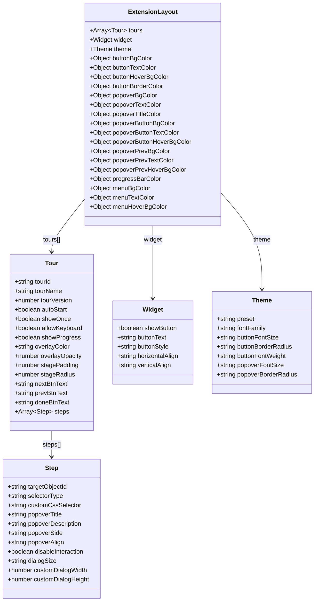
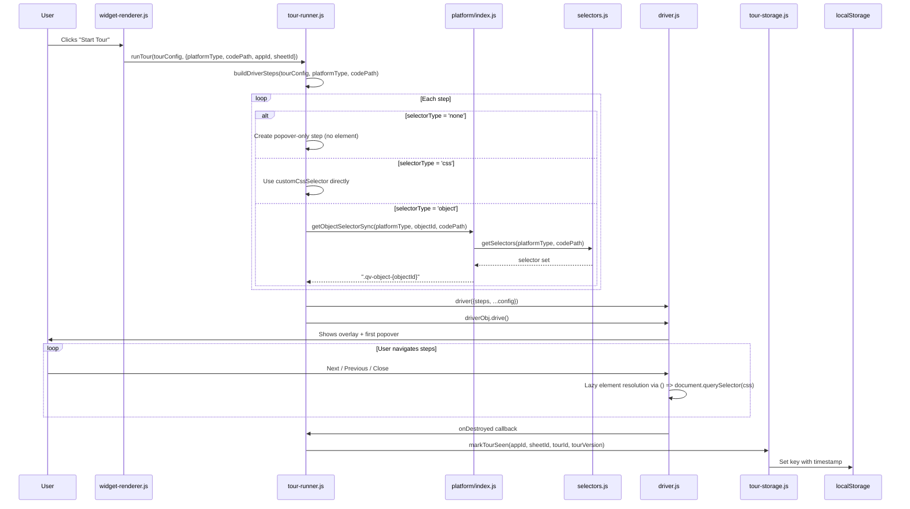
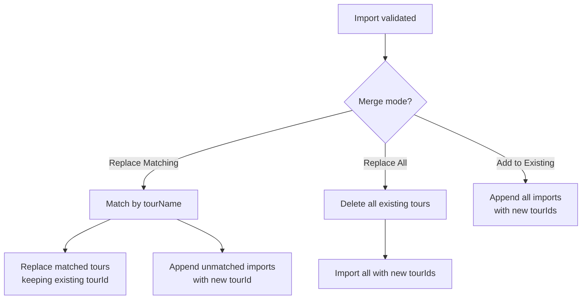

# Tour System

The tour system is the core feature of Onboard.qs. It allows Qlik Sense app developers to create interactive, step-by-step tours that highlight objects on a sheet with informational popovers, powered by [driver.js](https://driverjs.com/).

## Tour data model

Tours are stored in the extension's QAE properties (`layout.tours`). Each tour is an object with the following structure:



### Step selector types

Each step targets a DOM element using one of three selector strategies:

| `selectorType` | Behavior |
|---|---|
| `'object'` (default) | Uses `targetObjectId` → resolved via `getObjectSelectorSync()` to a `.qv-object-{id}` CSS selector |
| `'css'` | Uses `customCssSelector` directly — any valid CSS selector |
| `'none'` | No element — driver.js shows a centered modal dialog |

## Tour execution flow



## Auto-start tours

Tours with `autoStart: true` are triggered automatically when the sheet loads in analysis mode.

```mermaid
flowchart TD
    A[renderWidget called] --> B[handleAutoStart&#40;tours&#41;]
    B --> C{tour.autoStart?}
    C -- No --> D[Skip]
    C -- Yes --> E{tour.showOnce?}
    E -- No --> G[Start tour after 500ms delay]
    E -- Yes --> F{hasSeenTour?}
    F -- Yes --> H[Skip — already seen]
    F -- No --> G
```



The 500ms delay ensures Qlik objects have finished rendering before the tour overlay appears.

## "Show once" gating (tour-storage.js)

Tour completion is tracked in `localStorage` under keys with the format:

```text
onboard-qs:{appId}:{sheetId}:{tourId}:v{tourVersion}
```

| Function | Purpose |
|---|---|
| `hasSeenTour(appId, sheetId, tourId, version)` | Check if a key exists |
| `markTourSeen(appId, sheetId, tourId, version)` | Write key with timestamp JSON |
| `resetTourSeen(appId, sheetId, tourId, version)` | Remove a single key |
| `clearAllTourData()` | Remove all `onboard-qs:*` keys |

The version dimension allows re-showing a tour when the developer bumps `tourVersion`.

## Step element resolution

driver.js supports both static elements and lazy-evaluated functions. The extension uses **lazy evaluation** — each step's `element` is a function:

```javascript
element: () => document.querySelector(cssSelector)
```

This is critical because:

1. Qlik objects may not be in the DOM when the tour starts (e.g., objects below the fold that render lazily).
2. The DOM can change between step transitions in Qlik Sense.

## Tour editor (edit mode)

The tour editor is a full-screen modal overlay (`tour-editor.js`, ~879 lines) that opens when the user clicks "Edit Tours" in the extension placeholder.



```mermaid
flowchart TD
    subgraph "Tour Editor Modal"
        H[Header: Save / Cancel]
        TL[Tour List Panel<br/>Add, rename, delete tours]
        SL[Step List Panel<br/>Add, reorder, delete steps]
        SF[Step Form Panel<br/>Title, description, target object,<br/>selector type, popover settings]
        PV[Live Preview<br/>highlightStep&#40;&#41;]
    end

    TL --> SL
    SL --> SF
    SF --> PV
    PV --> |driver.js highlight| DOM[Qlik Sheet DOM]
```

### Editor workflow

1. **Open** — Deep-clones `layout.tours` to avoid mutating live properties.
2. **Edit** — User adds/removes tours and steps, configures each step's target object, title, description, popover position.
3. **Preview** — "Preview Step" calls `highlightStep()` which creates a temporary driver.js highlight on the actual Qlik object. Auto-dismisses after 3 seconds.
4. **Save** — Writes the modified tours back via `model.getProperties()` → mutate → `model.setProperties()`.
5. **Cancel** — Discards changes, clones are garbage-collected.

### Object picker

The step form includes a dropdown of all objects on the current sheet. The list is populated by calling `adapter.getSheetObjects(app)`, which uses the Engine API to enumerate objects and enrich their titles.

## Tour import & export

The tour editor includes **Export** and **Import** buttons (in the editor header) powered by `tour/tour-io.js`. This allows tour configurations to be shared across apps, backed up, or migrated between environments.

### Export

`exportToursAndTheme(layout)` serializes the following to a JSON file:

| Field | Content |
|---|---|
| `version` | Schema version (currently `1`) |
| `exportedAt` | ISO 8601 timestamp |
| `tours` | Complete tours array (all tours, steps, and settings) |
| `theme` | Theme configuration (preset, overrides) |
| `widget` | Widget settings (button text, style, alignment) |

The file is downloaded as `onboard-qs-tours.json` via a temporary `<a>` element.

### Import

`importFromFile()` opens a file picker, reads the selected JSON file, and validates it with `validateImportData()`:

- Must be a JSON object with a `tours` array
- Each tour must have a `tourName` (string) and `tourId` (string)
- Each tour must have a `steps` array

After validation, the tour editor shows an **import dialog** where the user selects a merge mode and optionally toggles **Import theme settings**.

### Merge modes

`mergeTours(existingTours, importedTours, mode)` combines tours according to the selected strategy:



### Standalone dialog sizes

When a step targets no element (`selectorType: 'none'`), the dialog size can be configured:

| Size | CSS class | Dimensions |
|---|---|---|
| Dynamic | `onboard-qs-dialog-dynamic` | Fit content |
| Small | `onboard-qs-dialog-small` | 320 × 220 px |
| Medium (default) | `onboard-qs-dialog-medium` | 480 × 320 px |
| Large | `onboard-qs-dialog-large` | 640 × 420 px |
| Extra Large | `onboard-qs-dialog-x-large` | 800 × 520 px |
| Custom | `onboard-qs-dialog-custom` | User-specified via `customDialogWidth` / `customDialogHeight` |

Custom dimensions are applied via `onPopoverRender` as inline styles on the popover wrapper.

## Markdown support in descriptions

Step descriptions support a subset of Markdown, converted to HTML by `util/markdown.js`:

| Syntax | Rendered as |
|---|---|
| `**bold**` | **bold** |
| `*italic*` | *italic* |
| `[text](url)` | hyperlink |
| `` | image |
| `` `code` `` | inline code |
| `### Heading` | h3–h6 |
| `> quote` | blockquote |
| `---` | horizontal rule |
| `- item` / `* item` | unordered list |
| `1. item` | ordered list |
| double newline | paragraph break |
| single newline | `<br>` |

The converter is intentionally minimal (~112 lines) to keep the bundle small.

## driver.js configuration

The extension configures driver.js with the following settings. Some are configurable per tour (via the property panel or tour editor), while others are hardcoded.

### Configurable per tour

| Setting | Default | Configured in | Notes |
|---|---|---|---|
| `showProgress` | `true` | Property panel | "1 of 5" progress text |
| `allowKeyboardControl` | `true` | Property panel | Arrow-key / Escape navigation |
| `overlayColor` | `rgba(0,0,0,0.6)` | Property panel + Tour editor | Semi-transparent backdrop |
| `overlayOpacity` | `60` (%) | Property panel + Tour editor | Opacity percentage (0–100) |
| `stagePadding` | `8` | Property panel + Tour editor | Padding around highlighted element (px) |
| `stageRadius` | `5` | Property panel + Tour editor | Border radius of the highlight cutout (px) |
| `nextBtnText` | `'Next'` | Property panel + Tour editor | Label for the Next button (expression-enabled in property panel) |
| `prevBtnText` | `'Previous'` | Property panel + Tour editor | Label for the Previous button (expression-enabled in property panel) |
| `doneBtnText` | `'Done'` | Property panel + Tour editor | Label for the final step's button (expression-enabled in property panel) |

### Fixed (not user-configurable)

| Setting | Value | Notes |
|---|---|---|
| `animate` | `true` | Smooth transitions between steps |
| `smoothScroll` | `true` | Scrolls to off-screen elements |
| `allowClose` | `true` | User can always dismiss the tour |
| `popoverClass` | `'onboard-qs-popover'` | Custom CSS class for Qlik Sense styling |
| `progressText` | `'{{current}} of {{total}}'` | Progress text template |
| `showButtons` | `['next', 'previous', 'close']` | All navigation buttons shown |

### CSS theming

All visual styling is driven by **CSS custom properties** (variables) generated by the theme resolver (`theme/resolve.js`). When the extension renders:

1. `resolveTheme(layout)` merges the selected preset's defaults with any per-property overrides from the layout.
2. The resulting CSS variable map is applied to the widget container via `applyThemeToElement()`.
3. For driver.js popovers (attached to `document.body`), `buildPopoverThemeCSS()` generates scoped CSS injected via `injectThemeStyle()`.

Four built-in presets are available: **Default**, **The Lean Green Machine**, **Corporate Blue**, and **Corporate Gold**. Each preset defines a complete set of colors, font sizes, border radii, and font family. Individual overrides (via color pickers and text inputs in the property panel) take precedence over the preset.

Cloud-specific z-index overrides ensure the overlay renders above the Cloud MUI toolbar:

```css
.driver-active .driver-overlay  { z-index: 99999 !important; }
.driver-active .driver-popover  { z-index: 100000 !important; }
```
