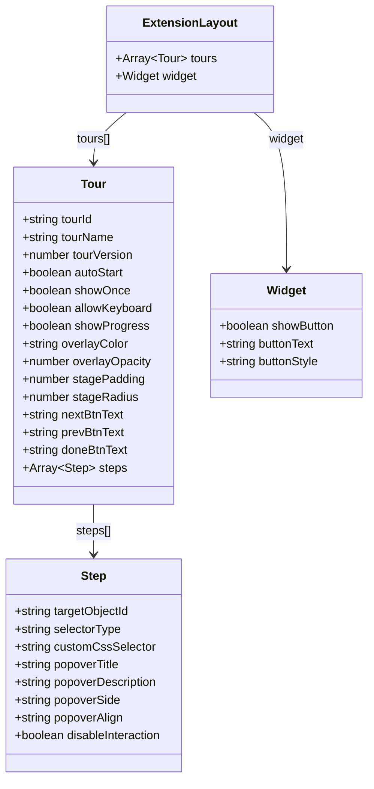
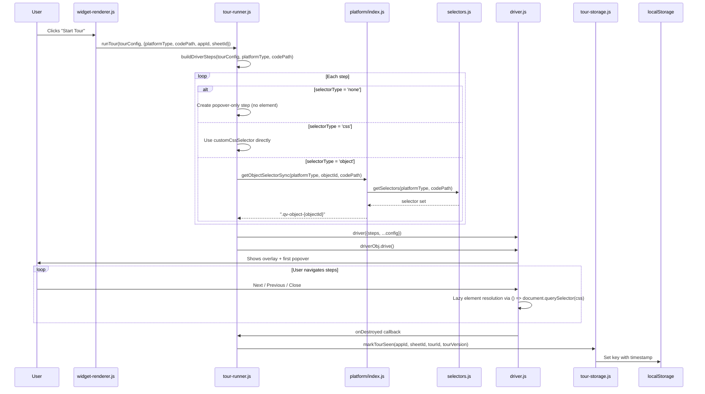

# Tour System

The tour system is the core feature of Onboard.qs. It allows Qlik Sense app developers to create interactive, step-by-step tours that highlight objects on a sheet with informational popovers, powered by [driver.js](https://driverjs.com/).

## Tour data model

Tours are stored in the extension's QAE properties (`layout.tours`). Each tour is an object with the following structure:



### Step selector types

Each step targets a DOM element using one of three selector strategies:

| `selectorType` | Behavior |
|---|---|
| `'object'` (default) | Uses `targetObjectId` → resolved via `getObjectSelectorSync()` to a `.qv-object-{id}` CSS selector |
| `'css'` | Uses `customCssSelector` directly — any valid CSS selector |
| `'none'` | No element — driver.js shows a centered modal dialog |

## Tour execution flow



## Auto-start tours

Tours with `autoStart: true` are triggered automatically when the sheet loads in analysis mode.

```mermaid
flowchart TD
    A[renderWidget called] --> B[handleAutoStart&#40;tours&#41;]
    B --> C{tour.autoStart?}
    C -- No --> D[Skip]
    C -- Yes --> E{tour.showOnce?}
    E -- No --> G[Start tour after 500ms delay]
    E -- Yes --> F{hasSeenTour?}
    F -- Yes --> H[Skip — already seen]
    F -- No --> G
```



The 500ms delay ensures Qlik objects have finished rendering before the tour overlay appears.

## "Show once" gating (tour-storage.js)

Tour completion is tracked in `localStorage` under keys with the format:

```text
onboard-qs:{appId}:{sheetId}:{tourId}:v{tourVersion}
```

| Function | Purpose |
|---|---|
| `hasSeenTour(appId, sheetId, tourId, version)` | Check if a key exists |
| `markTourSeen(appId, sheetId, tourId, version)` | Write key with timestamp JSON |
| `resetTourSeen(appId, sheetId, tourId, version)` | Remove a single key |
| `clearAllTourData()` | Remove all `onboard-qs:*` keys |

The version dimension allows re-showing a tour when the developer bumps `tourVersion`.

## Step element resolution

driver.js supports both static elements and lazy-evaluated functions. The extension uses **lazy evaluation** — each step's `element` is a function:

```javascript
element: () => document.querySelector(cssSelector)
```

This is critical because:

1. Qlik objects may not be in the DOM when the tour starts (e.g., objects below the fold that render lazily).
2. The DOM can change between step transitions in Qlik Sense.

## Tour editor (edit mode)

The tour editor is a full-screen modal overlay (`tour-editor.js`, ~715 lines) that opens when the user clicks "Edit Tours" in the extension placeholder.

```mermaid
flowchart TD
    subgraph "Tour Editor Modal"
        H[Header: Save / Cancel]
        TL[Tour List Panel<br/>Add, rename, delete tours]
        SL[Step List Panel<br/>Add, reorder, delete steps]
        SF[Step Form Panel<br/>Title, description, target object,<br/>selector type, popover settings]
        PV[Live Preview<br/>highlightStep&#40;&#41;]
    end

    TL --> SL
    SL --> SF
    SF --> PV
    PV --> |driver.js highlight| DOM[Qlik Sheet DOM]
```



### Editor workflow

1. **Open** — Deep-clones `layout.tours` to avoid mutating live properties.
2. **Edit** — User adds/removes tours and steps, configures each step's target object, title, description, popover position.
3. **Preview** — "Preview Step" calls `highlightStep()` which creates a temporary driver.js highlight on the actual Qlik object. Auto-dismisses after 3 seconds.
4. **Save** — Writes the modified tours back via `model.getProperties()` → mutate → `model.setProperties()`.
5. **Cancel** — Discards changes, clones are garbage-collected.

### Object picker

The step form includes a dropdown of all objects on the current sheet. The list is populated by calling `adapter.getSheetObjects(app)`, which uses the Engine API to enumerate objects and enrich their titles.

## Markdown support in descriptions

Step descriptions support a subset of Markdown, converted to HTML by `util/markdown.js`:

| Syntax | Rendered as |
|---|---|
| `**bold**` | **bold** |
| `*italic*` | *italic* |
| `[text](url)` | hyperlink |
| `` | image |
| `` `code` `` | inline code |
| `### Heading` | h3–h6 |
| `> quote` | blockquote |
| `---` | horizontal rule |
| `- item` / `* item` | unordered list |
| `1. item` | ordered list |
| double newline | paragraph break |
| single newline | `<br>` |

The converter is intentionally minimal (~60 lines) to keep the bundle small.

## driver.js configuration

The extension configures driver.js with these defaults (overridable per tour):

| Setting | Default | Notes |
|---|---|---|
| `animate` | `true` | Smooth transitions between steps |
| `smoothScroll` | `true` | Scrolls to off-screen elements |
| `allowClose` | `true` | User can dismiss at any time |
| `showProgress` | `true` | "1 of 5" progress text |
| `stagePadding` | `8` | Padding around highlighted element |
| `stageRadius` | `5` | Border radius of the highlight cutout |
| `popoverClass` | `'onboard-qs-popover'` | Custom CSS class for Qlik Sense styling |
| `overlayColor` | `rgba(0,0,0,0.6)` | Semi-transparent backdrop |

### CSS theming

All driver.js visual overrides are in `style.css` under the `.onboard-qs-popover` class. This includes colors that match the Qlik Sense design language (green accent buttons, clean typography).

Cloud-specific z-index overrides ensure the overlay renders above the Cloud MUI toolbar:

```css
.driver-active .driver-overlay  { z-index: 99999 !important; }
.driver-active .driver-popover  { z-index: 100000 !important; }
```
